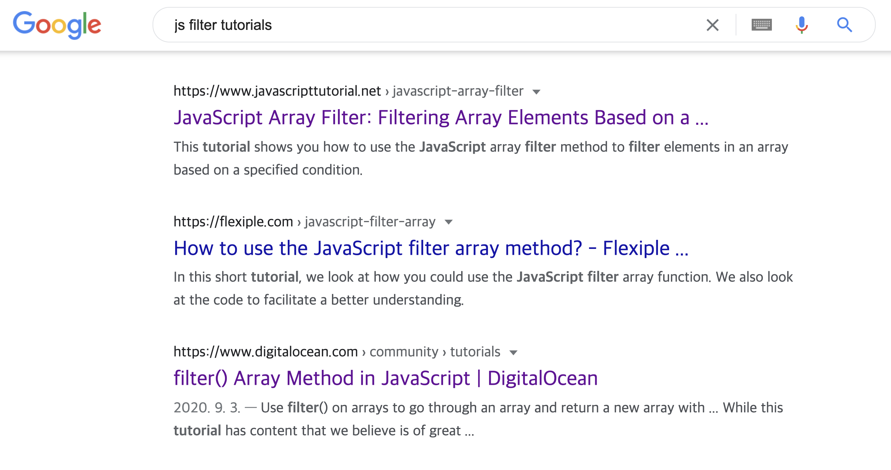

# 문서 작성 가이드

Cracking Vue.js 사이트 문서 작성 가이드입니다.

## 문서 작성 전

작성하고자 하는 주제나 개념에 대해 충분히 조사합니다. 예를 들어, 자바스크립트의 .filter() 메서드에 대한 사용법 가이드를 작성한다고 하면 최소 공식 스펙 문서인 [MDN](https://developer.mozilla.org/en-US/docs/Web/JavaScript/Reference/Global_Objects/Array/filter)과 잘 정리되어 있는 [JavaScript Info](https://javascript.info/array-methods)를 보고 실제 사례 코드나 튜토리얼도 같이 찾아봅니다. 실제 사례나 튜토리얼을 찾아보기 위해서는 구글에 대략 *js filter tutorials* 이런 형식으로 검색하여 잘 정돈된 사이트의 내용을 참고합니다.



문서를 잘 작성하는 방법의 시작은 해당 내용을 얼마나 깊이 이해하고 사례를 살펴봤는가입니다.

## 문서 작성 중

문서 작성을 시작할 때 먼저 목차를 구성합니다. 보통은 아래와 같은 형태로 글을 전개해 나가는 것을 추천드립니다. 앞에서 예시로 든 자바스크립트 .filter() 메서드를 보겠습니다.

- filter()의 정의
- filter()를 가장 쉽게 이해할 수 있는 하나의 예제와 설명
- filter()를 적용하면 좋은 곳들
- filter()를 사용했을 때와 사용하지 않고 구현한 코드의 차이점
- 기타

특정 개념과 주제를 설명할 때는 해당 개념에 대해 한 줄 정의를 내리는 습관을 들이시는 걸 추천드립니다. 한 줄 정의가 어려운 경우에는 보통 개념을 정확히 이해하지 못했거나 관련 내용을 충분히 학습하지 못했다고 볼 수 있습니다. 따라서 문서 작성 전으로 돌아가 관련 내용을 충분히 숙지합니다. 그리고 코드의 경우에는 보통 문서를 작성하기 전에 자기 스스로 코드를 구현해 보고 에러를 부딪혀 보면서 관련 내용을 더 깊이 이해하려고 하면 좋은 문서가 나온다고 생각합니다.

## 문서 작성 후

문서를 다 작성하고 나면 최소 2~3번 퇴고하시는 걸 추천드립니다. 문서를 작성하고 PR을 보내기 전까지 내가 작성한 글을 PC와 모바일에서 각각 최소 2번씩 읽어보면 글의 흐름이 부자연스럽거나 표현이 아쉬운 부분이 보이기 마련입니다. 해당 습관을 들이기까지는 시간이 꽤 걸리겠지만 반복해서 익숙해 지시면 더 퇴고 시간이 줄어들고 글의 흐름도 더 자연스러워집니다.

그리고 퇴고하는 중간에 더 자연스러운 글을 만들기 위해 아래 맞춤법 검사기를 이용하여 글을 다듬는 걸 추천합니다.

- [부산대 맞춤법 검사기](https://speller.cs.pusan.ac.kr/)
- [네이버 맞춤법 검사기](https://search.naver.com/search.naver?where=nexearch&sm=top_hty&fbm=0&ie=utf8&query=%EB%A7%9E%EC%B6%A4%EB%B2%95+%EA%B2%80%EC%82%AC%EA%B8%B0)

문서 작성에 들이시는 시간 못지않게 문서를 정리하는 시간도 중요합니다.

---

그외 문서 작성에 필요한 컨벤션을 소개합니다.

## 외래어 표기

가급적 모든 기술 용어는 첫 언급시에 다음과 같이 풀어쓰고 그 이후에는 읽기 쉽게 한글로 기술합니다.

ex)
자바스크립트(JavaScript)는 브라우저에서 동작하는 스크립트 언어입니다. 자바스크립트의 ....
웹팩(Webpack)은 프런트엔드 개발할 때 사용하는 빌드 도구입니다. 웹팩을 이용하여 ....

## 인라인 코드

문서의 중간에 코드 예시에서 사용한 코드를 가리킬 때는 마크다운 문법의 **``** 문법을 활용합니다.

ex) 위 코드에서 사용한 변수 `userInfo`는 속성 `name`과 `role`을 갖고 있습니다.

## 소스 코드 삽입

문서 작성 중 여러 줄의 소스 코드를 삽입할 때는 마크다운 문법의 <strong>\```</strong> 를 활용합니다. 삽입하는 소스의 언어를 <strong>\```</strong> 의 오른쪽에 기입해 주면 아래와 같이 하이라이팅이 됩니다.

ex)

```html
<div>html 소스 코드</div>
<p>굿굿</p>
```

```js
var a = 10;
a = 20;
```

## 이미지

문서 작성 중간에 이해를 돕는 이미지를 삽입하고 싶은 경우 마크다운 문법의 **! [] ()**를 활용합니다.

```

```

## 각주(tip, warning, danger, details)

본문 중간에 특정 용어에 대한 부가 설명 또는 팁, 주의 사항을 추가하고 싶을 때는 아래 문법을 활용합니다.

```
:::tip
뷰의 컴포넌트 구조는 리액트와 유사합니다.
:::
```

tip, warning, danger, details 여러 레벨로 나뉘기 때문에 해당 내용은 아래 링크를 참고하세요.

[VuePress Custom Container](https://vuepress.vuejs.org/guide/markdown.html#custom-containers)

## 참고 자료

참고 자료 링크는 아래와 같이 마크다운 문법을 활용합니다.

```
[웹팩 가이드](https://joshua1988.github.io/webpack-guide)
```