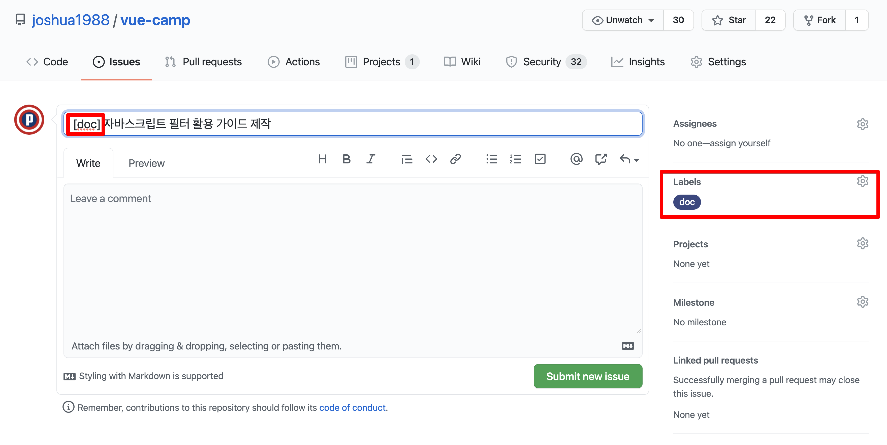

# PR & Commit 작성 가이드

## Commit 작성 가이드

커밋 메시지는 해당 변경 분량의 내용을 충분히 담을 수 있도록 간단 명료하게 핵심만 작성합니다.

```
[문서화] 자바스크립트 filter() 가이드 문서 작성
[자료 추가] 필터 동작 방식 관련 이미지 및 링크 삽입
```

커밋 메시지의 맨 앞에는 항상 `[]` 레이블로 해당 커밋 메시지의 유형을 분류해 줍니다. 예를 들면, `문서화`, `기능 구현`, `소스 추가`, `주석 추가/변경/삭제`, `파일명 변경` 등

## PR 작성 가이드

PR의 제목에도 Commit과 동일하게 레이블을 맨 앞에 표기해 줍니다.

```
[doc] 자바스크립트 filter() 활용 가이드 제작
[tool] 뷰프레스 다국어 플러그인 추가 및 관련 설정 변경
```

위 레이블은 이슈 생성할 때 선택한 레이블과 동일해야 합니다.




