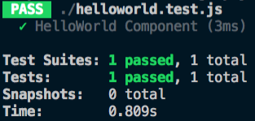

# 테스팅 도구와 테스팅 방법

테스팅 도구는 요구 사항 변경에 따른 기능 추가 및 리팩토링을 할 때 소프트웨어의 안정성을 높여주는 도구입니다. 복잡한 웹 애플리케이션일수록, 그리고 같이 협업하는 팀원이 많을수록 테스트 케이스를 바탕으로 각자 기능을 개발하면 변경에서 오는 에러를 미연에 방지할 수 있습니다.

## 테스팅 도구의 선택

시중에서 가장 많이 사용되는 테스팅 도구는 다음과 같습니다.

- [Jest](https://jestjs.io/)
- [Mocha](https://mochajs.org/)
- [Jasmine](https://jasmine.github.io/)
- [Enzyme](https://github.com/airbnb/enzyme)

이 챕터에서는 Jest를 기준으로 기술합니다.

## Jest 소개

Jest는 페이스북에서 만든 자바스크립트 테스팅 라이브러리입니다. 테스트 코드의 모양이 직관적이고 문서화가 잘되어 있어 요즘 많이 활용되고 있습니다.

### 라이브러리 설치

Jest는 NPM으로 아래와 같이 설치합니다.

```bash
npm install --save-dev jest
```

### 테스트 파일 생성

- 파일 위치 : 테스트 할 파일이 있는 폴더 내
- 폴더 이름 : `__test__`
- 파일 이름 : `파일 이름.test.js`

### 테스트 코드 실행

Jest를 설치하고 나면 콘솔 창에 아래와 같은 명령어로 실행할 수 있습니다.

```bash
jest
```

위의 명령어를 입력하면 프로젝트 내부의 `test.js` 확장자를 가지는 파일을 모두 실행합니다.

::: tip
NPM 커스텀 명령어나 `npm t`로 테스트를 실행할 수도 있습니다.
:::

### 테스트 코드 예시

간단한 테스트 코드를 아래와 같이 작성해봤습니다.

```js
// helloworld.test.js
const str = 'Hello World';

test('str equals to be Hello World', () => {
  expect(str).toBe('Hello World');
});
```

Jest의 장점은 문법이 상당히 직관적이라는 점입니다. `str`의 값이 `Hello World`가 인지 확인하는 테스트 코드입니다.
`expect()`에 테스트 할 내용을 넣고, `toBe()`에 예상 결과 값을 넣으면 됩니다.

이제 콘솔에 `jest` 명령어를 실행하면 다음과 같은 테스트 결과가 나옵니다.



## Jest API

Jest로 단위 테스트 코드를 구현할 때 자주 사용되는 API 목록입니다.

- describe()
- test()
- expect()
- beforeEach()

### describe()

여러 개의 `test()` 코드를 하나의 테스트 작업 단위로 묶어주는 API

```js
describe('Testing 1', () => {
  test('message equals to be Vue', () => {
    // ..
  });

  test('data equals to be Object', () => {
    // ..
  });
});
```

### test()

테스트를 돌리는 단위 API. `it()`과 같은 역할.

```js
test('message equals to be Vue', () => {
  // ..
});
```

### expect()

테스트의 결과를 예상하는 API. `expect()`에는 주로 테스트 입력 값을 넣습니다.

```js
let message = 'Vue';
test('message equals to be Vue', () => {
  expect(message).toBe('Vue');
});
```

### beforeEach()

테스트 파일의 테스트 코드가 돌기 전에 수행할 로직을 넣는 API

```js
let message;
beforeEach(() => message = fetchMessage());

test('message equals to be Vue', () => {
  expect(message).toBe('Vue');
});
```

## Jest의 뷰 컴포넌트 테스팅

간단한 테스트 코드를 돌려봤으니 이번엔 간단한 뷰 컴포넌트를 테스트 해보겠습니다.

```html
<!-- HelloWorld.vue -->
<template>
  <div> Hello {{ messsage }} </div>
</template>

<script>
export default {
  data() {
    return {
      message: 'Vue!'
    }
  }
}
</script>
```

```js
// helloworld.test.js
import HelloWorld from './HelloWorld.vue';

test('HelloWorld Component', () => {
  expect(true).toBe(true);
});
```

위의 테스트 코드는 HelloWorld 컴포넌트를 Jest에서 인식할 수 있는지만 확인하는 코드입니다.
테스트의 예상 값과 결과 값은 true로 일치하기 때문에 HelloWorld 컴포넌트만 잘 들고온다면 실패 없이 테스트가 완료됩니다.

하지만, 실제로 실행해보면 테스트가 실패하면서 아래와 같은 결과가 나옵니다.


뷰 컴포넌트는 Jest가 해석할 수 있는 유형의 파일이 아니다... 라고 나옵니다. 생각해보면 싱글 파일 컴포넌트가 웹팩의 Vue Loader로 해석되어서 웹 자원으로 최종 변환이 되기 때문에
Jest도 이렇게 변환해주는 도구가 필요할 것 같습니다.

그럼 다음 챕터에서 뷰 테스팅을 도와주는 도구인 Vue Test Utils를 보겠습니다.