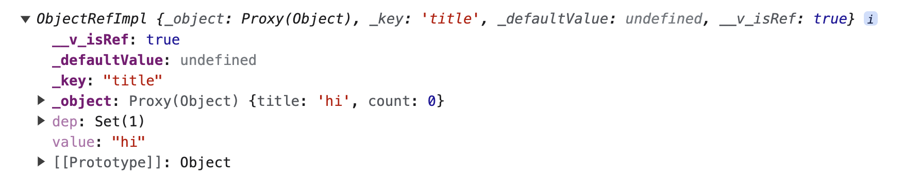

# Props - setup() <Badge text="Vue 3" />

[프롭스](/vue/props)는 컴포넌트 간에 데이터를 주고받기 위한 속성입니다. 컴포지션(Composition API)에서 프롭스를 사용하는 방법을 알아보겠습니다.

## setup()에서 props 사용하는 방법

`items` 라는 프롭스 속성을 `setup()` 함수에서 접근하려면 다음과 같이 작성합니다.

```html
<script>
export default {
  props: ['items'],
  setup(props) {
    console.log(props.items);
  }
}
</script>
```

위 코드는 List 컴포넌트에 `items` 프롭스 속성을 정의하고 셋업 함수 안에서 프롭스 속성을 출력한 코드입니다. 
`setup()` 함수의 첫 번째 인자는 프롭스 속성을 의미합니다. 인스턴스 옵션 속성으로 `props:`를 정의하고 나면 `setup()` 함수를 정의할 때 첫 번째 인자로 프롭스 속성을 접근할 수 있습니다.

## setup()에서 props를 다룰 때 주의할 점

`setup()` 함수에서 프롭스 속성을 사용할 때 [디스트럭처링 문법](/es6+/destructuring)을 주의해야 합니다. 프롭스 속성이 여러개 정의되어 있을 때 아마 본능적으로 다음과 같이 속성을 꺼내어 쓸 수 있는 디스트럭처링 문법을 사용할 수도 있을텐데요.

```html
<script>
export default {
  props: ['items', 'userId', 'title'],
  setup(props) {
    const { items, userId, title } = props;
    console.log(items);
  }
}
</script>
```

이렇게 하면 안됩니다. 안타깝지만 앞에서 살펴봤던 코드처럼 `props.items` 형태로 접근해서 사용하는 것이 좋습니다. 왜냐하면 프롭스 속성에 디스트럭처링 문법을 사용하면 반응성(리액티비티)이 사라지기 때문입니다. 

아래 코드는 `message` 값이 변했을 때 `reversedMessage` 값이 정상적으로 갱신되지 않습니다.

```html
<script>
import { computed } from 'vue';

export default {
  props: ['message'],
  setup(props) {
    const { message } = props;
    
    const reversedMessage = computed(() => {
      return message.split('').reverse().join('');
    });

    return { reversedMessage }
  }
}
</script>
```

왜냐하면 프롭스 속성인 `message` 값이 변할 때마다 `computed()` 로직도 같이 실행이 되어야 하는데 반응성이 사라졌기 때문에 `computed()`에서 로직이 실행되지 않기 때문입니다. 따라서, 아래와 같이 `props.message` 형태로 접근하는 것을 추천합니다.

```html
<script>
import { computed } from 'vue';

export default {
  props: ['message'],
  setup(props) {
    const reversedMessage = computed(() => {
      return props.message.split('').reverse().join('');
    });

    return { reversedMessage }
  }
}
</script>
```

## 디스트럭처링을 쓰고 싶다면?

그래도 컴포넌트에서 프롭스 속성을 빈번하게 사용하고 있다면 디스트럭처링을 사용하고 싶을 겁니다. 그럴 때는 다음과 같이 [toRefs() API](https://vuejs.org/api/reactivity-utilities.html#torefs)를 사용합니다.

```html
<script>
import { toRefs } from 'vue';

export default {
  props: ['message'],
  setup(props) {
    const { message } = toRefs(props);
  }
}
</script>
```

`toRefs()`를 임포트하고 `props`를 인자로 넘기면 프롭스 속성을 디스트럭처링 할 수 있습니다. 다만, 이렇게 한다고 해서 기존과 같이 동일하게 프롭스 값에 접근할 수 없습니다. 아래 코드에서 디스트럭처링한 `message`는 예상한 것과 다르게 값으로 인식되지 않습니다.

```html
<script>
import { computed } from 'vue';

export default {
  props: ['message'],
  setup(props) {
    const { message } = toRefs(props);
    
    const reversedMessage = computed(() => {
      return message.split('').reverse().join(''); // 에러 발생: `message.split is not a function`
    });

    return { reversedMessage }
  }
}
</script>
```

왜 위와 같은 결과가 나오는지 눈으로 확인하기 위해서 디스트럭처링한 `message` 속성을 콘솔에 출력해 보면 다음 내용이 나옵니다.



`message` 속성 값인 hi가 출력되지 않고 *ObjectRefImpl*이라는 객체가 출력됩니다. 이 객체는 마치 반응성을 주입하기 위해 사용했던 [ref() API](/reuse/composition.html#ref-소개)를 실행한 것과 같은 형태입니다. 따라서, 아래와 같이 `message.value`에 접근해야 합니다.

```js{5}
setup(props) {
  const { message } = toRefs(props);
  
  const reversedMessage = computed(() => {
    return message.value.split('').reverse().join('');
  });

  return { reversedMessage }
}
```