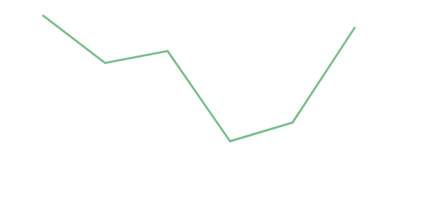

## 소개
D3(Data-Driven Documents)는 데이터를 기반으로 동적이고 인터렉티브한 정보시각화를 구현하기 위한 JavaScript(자바스크립트) 라이브러리입니다. 


## SVG 사용
SVG와 HTML5, CSS 등 웹표준에 기반해 구현되어 있습니다. 

SVG(Scalable Vector Graphics)란 그래픽을 마크업하기 위한 언어로 아래 뷰 로고와 같은 그래픽등을 표현 할 수 있습니다. HTML이 헤더, 문단, 표와 같은 엘리먼트(Element)를 제공하는 것처럼 SVG도 원, 사각형, 간단한 곡선과 복잡한 곡선을 그릴 수 있는 엘리먼트들을 제공합니다.

<svg width="122.88" height="106.42" viewBox="0 0 122.88 106.42" style="enable-background:new 0 0 122.88 106.42">
    <g>
        <polygon class="st0" fill="#4DBA87" points="75.63,0 61.44,24.58 47.25,0 0,0 61.44,106.42 122.88,0 75.63,0"/>
        <polygon class="st1" fill="#425466" points="75.63,0 61.44,24.58 47.25,0 24.58,0 61.44,63.85 98.3,0 75.63,0"/>
    </g>
</svg>

:::tip
SVG에 대한 기술적인 세부사항은 [MDN문서](https://developer.mozilla.org/ko/docs/Web/SVG/Tutorial)의 튜토리얼을 확인해주세요.
:::

## 데이터 시각화

다음과 같은 자바스크립트 배열이 있습니다. 이 데이터를 SVG의 패스(path) 엘리먼트를 사용해서 선 모양으로 시각화 할 수 있습니다.

```js
const data = [90, 72, 75, 25, 10, 92];
```

패스의 모양은 특정 알파벳으로 이루어진 명렁과 XY 좌표로 이루어진 d 속성으로 만들어지는데, 아래 예제의 `M20,45.99999999999999L112,92.80000000000001L204,85L296,215L388,254L480,40.79999999999999 ` 문자열이 `data` 배열 객체를 시각화하는데 사용된 값 입니다.

```html
<svg width="500" height="300">
    <g transform="translate(0, 0)">
        <path
            fill="none"
            stroke="#76BF8A"
            stroke-width="3"
            d="M20,45.99999999999999L112,92.80000000000001L204,85L296,215L388,254L480,40.79999999999999"
        ></path>
    </g>
</svg>
```

위처럼 데이터를 SVG 그래픽 요소로 시각화하기 위해 사용되는 속성 값들을 계산할 때 D3에서 제공하는 함수를 사용 할 수 있습니다.

```js
const xScale = d3
  .scaleLinear()
  .range([20, 480])
  .domain(d3.extent(data, (d, i) => i));

const yScale = d3.scaleLinear().range([280, 20]).domain([0, 100]);

const line = d3
  .line()
  .x((d, i) => xScale(i))
  .y((d) => yScale(d));

console.log(line(data)) // M20,45.99999999999999L112,92.80000000000001L204,85L296,215L388,254L480,40.79999999999999 

```


## 문서 조작
jQuery(제이쿼리)와 유사한 방식으로 돔에 접근해서 계산된 데이터 값을 바인딩하고 스타일을 설정하고 화면에 렌더링(rendering) 합니다.

```js

const svg = d3.select('svg')
    .attr('width', 500)
    .attr('height', 300)

svg
    .append('path')
    .datum(data)
    .attr("fill", "none")
    .attr("stroke", "#76BF8A")
    .attr("stroke-width", 3)
    .attr("d", line);

```

## 예제 코드
전체 코드를 실행 해보겠습니다. [실행 해보기](https://codesandbox.io/s/vuecamp-d3withvue-example-d3-only-wpybk)

<code-group>

<code-block title="javaScript">
```js
// chart.js
import * as d3 from "d3";

const data = [90, 72, 75, 25, 10, 92];

const svg = d3
  .select("svg")
  .attr("width", 500)
  .attr("height", 300)
  .append("g")
  .attr("transform", `translate(0, 0)`);

const x = d3
  .scaleLinear()
  .range([20, 480])
  .domain(d3.extent(data, (d, i) => i));

const y = d3.scaleLinear().range([280, 20]).domain([0, 100]);

const line = d3
  .line()
  .x((d, i) => x(i))
  .y((d) => y(d));

svg
  .append("path")
  .datum(data)
  .attr("fill", "none")
  .attr("stroke", "#76BF8A")
  .attr("stroke-width", 3)
  .attr("d", line);


```
</code-block>

<code-block title="html">
```html
<!-- index.html -->
<!DOCTYPE html>
<html lang="en">
<head>
    <meta charset="UTF-8">
    <meta http-equiv="X-UA-Compatible" content="IE=edge">
    <meta name="viewport" content="width=device-width, initial-scale=1.0">
    <title>Vue Camp - D3 with Vue Example</title>
</head>
<body>
    <svg></svg>
</body>
    <script src="./chart.js" type="module"></script>
</html>


```
</code-block>

</code-group>

**결과**



 