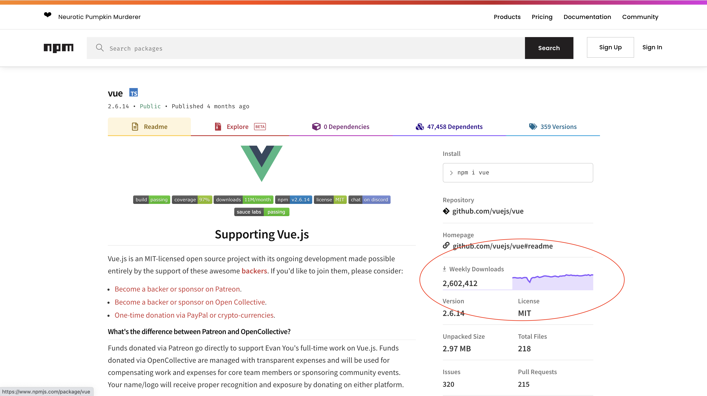

## 실습 예제

이번 챕터에서는 앞의 코드를 응용해서 조금 더 실전적인 예제를 작성해 보겠습니다. 구현해 볼 예제는 npm에 배포된 외부 라이브러리를 사용하기 위해 npm 패키지 페이지를 방문하면 보이는 차트 영역입니다.



위 이미지는 Vue의 npm 페이지로 동그라미 친 부분은 주별 다운로드 횟수 추이를 시각화하여 보여주고 있습니다.

### 데이터 준비

패키지 다운로드 횟수 추이를 시각화한 차트 영역을 살펴보면 전일부터 364일간의 일별 다운로드 횟수를 요일 상관없이 7일씩 합쳐서 총 52주치의 데이터임을 알 수 있습니다.

npm 레지스트리 패키지 다운로드 횟수 문서의 API 호출 가이드에 따라서 `https://api.npmjs.org/downloads/range/2020-10-12:2021-10-10/vue` 와 같이 URL을 만들어서 다운로드 횟수 데이터를 웹 브라우저에서 조회해 볼 수 있습니다.

:::tip
자세한 내용은 [npm 레지스트리 패키지 다운로드 횟수 문서](https://github.com/npm/registry/blob/master/docs/download-counts.md)를 확인해 주세요
:::

웹 브라우저에서 조회되는 데이터는 일별 다운로드 횟수입니다. 전체를 복사해서 다음 `jsonData` 변수에 대입해서  7일마다의 다운로드 합계를 52개 반환하는 함수를 완성합니다.

```js
// data-vue.js
const jsonData = ... // 웹 브라우저에서 조회한 데이터를 전체 복사한 다음 여기에 붙여 넣으세요
export const fetchData = () => {
    return jsonData.downloads.reduce((accumulator, currentValue, index) => {
        if (index % 7 === 0) {
            const data = {
                label: currentValue.day + ' to ',
                downloads: 0
            }
            accumulator.push(data)
        } else if (index % 7 === 6) {
            accumulator[accumulator.length -1].label += currentValue.day

        }
        accumulator[accumulator.length -1].downloads += currentValue.downloads

        return accumulator
    }, [])
}
```

### 스파크 라인 그리기

이전에 진행한 샘플 코드에서 SVG 영역의 전체 크기를 조정하고 선을 그리는 path 요소 외에 영역을 그리는 path 요소를 추가한 다음 스파크 라인 느낌을 살리는 스타일링을 더해줍니다.

```html{10-15,54-59}
<template>
    <svg
        class="sparkline"
        :width="width"
        :height="height"
        stroke-width="3"
        stroke="#8956FF"
        fill="rgba(137, 86, 255, .2)"
    >
        <path
            class="sparkline--fill"
            stroke="none"
            :d="area(weeklyDownloads)"
        >
        </path>
        <path
            class="sparkline--line"
            fill="none"
            :d="line(weeklyDownloads)"
        >
        </path>
    </svg>
</template>

<script>
import * as d3 from 'd3'
import { fetchData } from './data-vue'
export default {
    data () {
        return {
            width: 200,
            height: 40,
        }
    },
    computed: {
        weeklyDownloads () {
            return fetchData()
        },
        xScale () {
            return d3.scaleLinear()
                .domain([0, this.weeklyDownloads.length])
                .range([8, this.width])
        },
        yScale () {
            return d3.scaleLinear()
                .domain([0, d3.max(this.weeklyDownloads, d => d.downloads)]).nice()
                .range([this.height, 5])
        },
        line () {
            return d3.line()
                .x((d, i) => this.xScale(i))
                .y(d => this.yScale(d.downloads))
        },
        area () {
            return d3.area()
                .x((d, i) => this.xScale(i))
                .y0(this.yScale(0))
                .y1(d => this.yScale(d.downloads))
        }
    }
}
</script>
```

### 커서 이벤트 추가하기

npm 패키지 페이지의 마크업을 참고해서 커서로 사용되는 요소인 `line`과 `circle`을 추가합니다. 기본적으로 커서를 보여주지 않기 위해 좌표 값으로 -1000을 가지는 변수를 `data`에 정의합니다. 마우스를 차트 영역에 올렸을 때 커서를 보여주기 위한 좌표값은 `path` 데이터 값을 구할 때 사용한 `xScale`과 `yScale`을 활용해서 `xPoint`, `yPoint`로 각각 구합니다. 기본값으로 -1000을 가지는 `data`의 좌표 값 변수를 새로운 좌표 값으로 업데이트하는 이벤트 핸들러를 `methods`에 만들어줍니다.

```html{5-14,26-28,34-39,41-60}
<template>
        .
        .
        </path>
        <line class="sparkline--cursor" :x1="lineX" :x2="lineX" y1="0" y2="40" stroke-width="2"></line>
        <circle class="sparkline--spot" :cx="cx" :cy="cy" r="2"></circle>
        <rect
            class="sparkline--interaction-layer"
            style="fill: transparent; stroke: transparent"
            :width="width"
            :height="height"
            @mousemove="mousemoveHandler"
            @mouseout="mouseoutHandler"
        ></rect>
    </svg>
</template>

<script>
import * as d3 from 'd3'
import { fetchData } from './data-vue'
export default {
    data () {
        return {
            width: 200,
            height: 40,
            lineX: -1000,
            cx: -1000,
            cy: -1000,
        }
    },
    computed: {
        .
        .
        xPoint () {
            return this.weeklyDownloads.map((d, i) => this.xScale(i))
        },
        yPoint () {
            return this.weeklyDownloads.map(d => this.yScale(d.downloads))
        },
    },
    methods: {
        hideCusor () {
            this.lineX = -1000
            this.cx = -1000
            this.cy = -1000
        },
        mousemoveHandler (event) {
            const pointIndex = this.xPoint.findIndex(d => event.layerX <= d)
            if (pointIndex < 0) {
                this.hideCusor()
            } else {
                this.lineX = this.xPoint[pointIndex]
                this.cx = this.xPoint[pointIndex]
                this.cy = this.yPoint[pointIndex]
            }
        },
        mouseoutHandler () {
            this.hideCusor()
        }
    }
}
</script>
```

### 끝내기

마지막으로 npm 페이지를 참고해서 스타일링과 마크업을 더하고 `methods`에 정의한 이벤트 핸들러를 보완합니다.

### 전체코드

[실행해보기](https://codesandbox.io/s/vuecamp-d3withvuetutorial-rwnuv?file=/src/components/SparkLine.vue)

<iframe src="https://codesandbox.io/embed/vuecamp-d3withvuetutorial-rwnuv?fontsize=14&hidenavigation=1&theme=dark&view=preview"
     style="width:100%; height:500px; border:0; border-radius: 4px; overflow:hidden;"
     title="VueCamp_D3WithVueTutorial"
     allow="accelerometer; ambient-light-sensor; camera; encrypted-media; geolocation; gyroscope; hid; microphone; midi; payment; usb; vr; xr-spatial-tracking"
     sandbox="allow-forms allow-modals allow-popups allow-presentation allow-same-origin allow-scripts"
   ></iframe>

```html
<template>
  <div class="downloads">
    <h3 class="downloads--title">
      {{ downloadTitle }}
    </h3>
    <div class="downloads--container">
      <svg
        class="sparkline"
        :width="width"
        :height="height"
        stroke-width="3"
        stroke="#8956FF"
        fill="rgba(137, 86, 255, .2)"
      >
        <path
          class="sparkline--fill"
          stroke="none"
          :d="area(weeklyDownloads)"
        ></path>
        <path
          class="sparkline--line"
          fill="none"
          :d="line(weeklyDownloads)"
        ></path>
        <line
          class="sparkline--cursor"
          :x1="lineX"
          :x2="lineX"
          y1="0"
          y2="40"
          stroke-width="2"
        ></line>
        <circle
          class="sparkline--spot"
          :cx="cx"
          :cy="cy"
          r="2"
        ></circle>
        <rect
          class="sparkline--interaction-layer"
          style="fill: transparent; stroke: transparent"
          :width="width"
          :height="height"
          @mousemove="mousemoveHandler"
          @mouseout="mouseoutHandler"
        ></rect>
      </svg>
      <p class="downloads--count">
        {{
          downloadValue ||
          weeklyDownloads[weeklyDownloads.length - 1].downloads
            .toString()
            .replace(/\B(?=(\d{3})+(?!\d))/g, ",")
        }}
      </p>
    </div>
  </div>
</template>

<script>
import * as d3 from "d3";
import { fetchData } from "./data-vue";
export default {
  data() {
    return {
      width: 200,
      height: 40,
      lineX: -1000,
      cx: -1000,
      cy: -1000,
      downloadTitle: "Weekly Downloads",
      downloadValue: null,
    };
  },
  computed: {
    weeklyDownloads() {
      return fetchData();
    },
    xScale() {
      return d3
        .scaleLinear()
        .domain([0, this.weeklyDownloads.length])
        .range([8, this.width]);
    },
    yScale() {
      return d3
        .scaleLinear()
        .domain([0, d3.max(this.weeklyDownloads, (d) => d.downloads)])
        .nice()
        .range([this.height, 5]);
    },
    line() {
      return d3
        .line()
        .x((d, i) => this.xScale(i))
        .y((d) => this.yScale(d.downloads));
    },
    area() {
      return d3
        .area()
        .x((d, i) => this.xScale(i))
        .y0(this.yScale(0))
        .y1((d) => this.yScale(d.downloads));
    },
    xPoint() {
      return this.weeklyDownloads.map((d, i) => this.xScale(i));
    },
    yPoint() {
      return this.weeklyDownloads.map((d) => this.yScale(d.downloads));
    },
  },
  methods: {
    resetGraph() {
      this.lineX = -1000;
      this.cx = -1000;
      this.cy = -1000;
      this.downloadTitle = "Weekly Downloads";
      this.downloadValue = null;
    },
    updateGraph(pointIndex) {
      this.lineX = this.xPoint[pointIndex];
      this.cx = this.xPoint[pointIndex];
      this.cy = this.yPoint[pointIndex];
      this.downloadTitle = this.weeklyDownloads[pointIndex].label;
      this.downloadValue = this.weeklyDownloads[pointIndex].downloads
        .toString()
        .replace(/\B(?=(\d{3})+(?!\d))/g, ",");
    },
    mousemoveHandler(event) {
      const pointIndex = this.xPoint.findIndex((d) => event.layerX <= d);
      if (pointIndex < 0) {
        this.resetGraph();
      } else {
        this.updateGraph(pointIndex);
      }
    },
    mouseoutHandler() {
      this.resetGraph();
    },
  },
};
</script>

<style scoped>
.downloads {
  width: 390px;
}
.downloads--title {
  margin-top: 0.5rem;
  margin-bottom: 0;
  font-size: 1rem;
  color: #757575;
}
.downloads--container {
  display: flex;
  align-items: flex-end;
  flex-direction: row-reverse;
  border-bottom: 2px solid rgba(137, 86, 255, 0.2);
}
.sparkline {
  margin-right: -4px;
}
.downloads--count {
  flex: 1 1 auto;
  padding-bottom: 0.25rem;
  padding-right: 0.5rem;
  margin: 0;
  font-weight: 600;
  font-size: 1rem;
}
</style>
```

## D3 Gallery 예제

다양한 D3 예제를 모아놓은 [D3 Gallery](https://observablehq.com/@d3/gallery)의 코드를
뷰로 전환한 더 많은 실습 코드를 [여기](https://github.com/Seungwoo321/vue-d3-tutorial)에서 확인할 수 있습니다.
