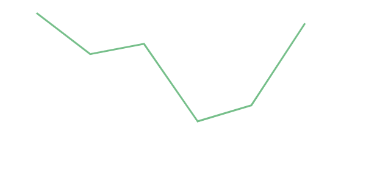

# 뷰에서 D3 사용하기

디쓰리(D3)는 시각화 구성 요소와 돔(DOM) 조작을 결합한 강력한 데이터 시각화 자바스크립트(JavaScript) 라이브러리로 HTML, SVG 및 CSS를 사용하여 데이터에 생명을 불어 넣습니다.

하지만 디쓰리는 뷰와 유사한 작업을 수행하기 때문에 결합하려고 하면 논리 일관성을 유지하기가 어려울 수 있습니다. 디쓰리는 수학적 계산을 수행하여 데이터 시각화에 필요한 데이터를 생성하고 뷰는 반응성을 수용하면서 돔을 조작하여 이 충돌을 해결할 수 있습니다. 더 쉽게 이해할 수 있도록 예제를 통해 살펴 보겠습니다.


## 일반적인 D3
먼저 디쓰리의 돔 조작 함수를 사용하여 간단한 꺾은 선형 차트(Chart)를 그려보겠습니다. 아래 코드는 `data` 변수의 값을 선 그래프를 표현하기 위한 계산을 수행하고 SVG 요소에 접근해서 패스(path) 요소를 추가합니다.

:::tip
패스는 선 뿐만 아니라 여러 개의 직선과 곡선을 합쳐서 복잡한 도형을 그릴 수 있게 해주는 가장 강력한 SVG 요소입니다.
:::


**코드**

[실행해보기](https://codesandbox.io/s/vuecamp-d3withvue-example-d3-only-wpybk)

<code-group>

<code-block title="javaScript">
```js
// chart.js
import * as d3 from "https://cdn.skypack.dev/d3@7";

const data = [90, 72, 75, 25, 10, 92];
const margin = {
    top: 20,
    right: 20,
    bottom: 40,
    left: 40
};
const width = 500;
const height = 300;

const svg = d3.select('svg')
    .attr('width', width)
    .attr('height', height)
    .append('g')
    .attr('transform', `translate(0, 0)`);

const x = d3.scaleLinear()
    .range([margin.left, width - margin.right])
    .domain(d3.extent(data, (d, i) => i));
const y = d3.scaleLinear()
    .range([height - margin.bottom, margin.top])
    .domain([0, 100]);

const line = d3.line()
    .x((d, i) => x(i))
    .y(d => y(d));

svg
    .append('path')
    .datum(data)
    .attr("fill", "none")
    .attr("stroke", "#76BF8A")
    .attr("stroke-width", 3)
    .attr("d", line);

svg.append('g')
    .attr("transform", `translate(0, ${height - margin.bottom})`)
    .call(d3.axisBottom(x).ticks(data.length).tickSizeOuter(0));

svg.append('g')
    .attr("transform", `translate(${margin.left}, 0)`)
    .call(d3.axisLeft(y));

```
</code-block>

<code-block title="html">
```html
<!-- index.html -->
<!DOCTYPE html>
<html lang="en">
<head>
    <meta charset="UTF-8">
    <meta http-equiv="X-UA-Compatible" content="IE=edge">
    <meta name="viewport" content="width=device-width, initial-scale=1.0">
    <title>Vue Camp - D3 with Vue Example</title>
</head>
<body>
    <svg></svg>
</body>
    <script src="./chart.js" type="module"></script>
</html>
```
</code-block>

</code-group>

**결과**



돔에 직접 접근해 화면 요소를 제어하는 방식이 제이쿼리(jQuery)와 유사하다는 점을 눈치채셨을 겁니다. 다음 코드를 추가해서 같은 방식으로 x축과 y축을 화면에 그립니다.

**코드**

```js
// chart.js
svg.append('g')
    .attr("transform", `translate(0, ${height - margin.bottom})`)
    .call(d3.axisBottom(x).ticks(data.length).tickSizeOuter(0))

svg.append('g')
    .attr("transform", `translate(${margin.left}, 0)`)
    .call(d3.axisLeft(y))
```

**결과**


## 뷰에서의 D3
이번에는 뷰입니다. `select`, `append` 와 같은 디쓰리의 돔 접근 함수는 뷰 템플릿(template)에서 마크업으로 대신하고 데이터 시각화를 위한 패스 계산과 같은 수학적 연산에는 디쓰리 유틸 함수를 사용합니다.

**코드**

[실행해보기](https://codesandbox.io/s/vuecamp-d3withvue-example-d3-with-vue-lhygp)

```html
<!-- VueLineChart.vue -->
<template>
    <svg :width="width" :height="height">
        <path fill="none" stroke="#76BF8A" stroke-width="3" :d="path"></path>
         <g
                class="xAxis"
                :transform="`translate(0, ${height - margin.bottom})`"
                fill="none"
                font-size="10"
                font-family="sans-serif"
                text-anchor="middle"
            >
            <path class="doamin" stroke="currentColor" :d="`M${x(xTicks[0])},0H${x(xTicks[xTicks.length - 1])}`"></path>
            <g
                v-for="(v, i) in xTicks"
                :key="`xAxis-tick-${i}`"
                class="tick"
                opacity="1"
                :transform="`translate(${x(v)},0)`"
            >
            
                <line stroke="currentColor" y2="6"></line>
                <text fill="currentColor" y="9" dy="0.71em">
                    {{ v }}
                </text>
            </g>
        </g>
        <g
            class="yAxis"
            :transform="`translate(${margin.left}, 0)`"
            fill="none"
            font-size="10"
            font-family="sans-serif"
            text-anchor="end"
        >
            <path class="doamin" stroke="currentColor" :d="`M-6,${y(yTicks[0])}H0V${y(yTicks[yTicks.length - 1])}H-6`"></path>
            <g
                v-for="(v, i) in yTicks"
                :key="`xAxis-tick-${i}`"
                class="tick"
                opacity="1"
                :transform="`translate(0,${y(v)})`"
            >
                <line stroke="currentColor" x2="-6"></line>
                <text fill="currentColor" x="-9" dy="0.32em">
                    {{ v }}
                </text>
            </g>
        </g>
    </svg>
</template>

<script>
import * as d3 from 'd3'
export default {
    data () {
        return {
            data: [90, 72, 75, 25, 10, 92],
            width: 500,
            height: 300,
            margin: {
                top: 20,
                right: 20,
                bottom: 40,
                left: 40
            }
        }
    },
    computed: {
        yTicks () {
            return this.y.ticks()
        },
        xTicks () {
            return this.x.ticks(this.data.length)
        },
        path () {
            return this.line(this.data)
        },
        line () {
            return d3.line()
                .x((d, i) => this.x(i))
                .y(d => this.y(d))
        },
        x () {
            return d3.scaleLinear()
                .range([this.margin.left, this.width - this.margin.right])
                .domain(d3.extent(this.data, (d, i) => i))
        },
        y () {
            return d3.scaleLinear()
                .range([this.height - this.margin.bottom, this.margin.top])
                .domain([0, 100])
        }
    }
}
</script>
```


위의 코드는 뷰의 가상 돔을 그대로 활용하고 계산과 렌더링(rendering)이 명확하게 분리되어 있기 때문에 구성요소를 더 쉽게 이해할 수 있습니다.


