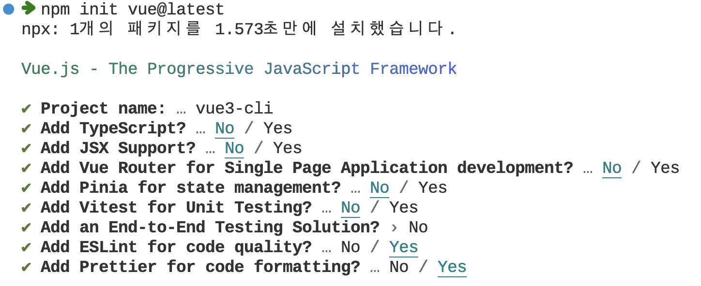
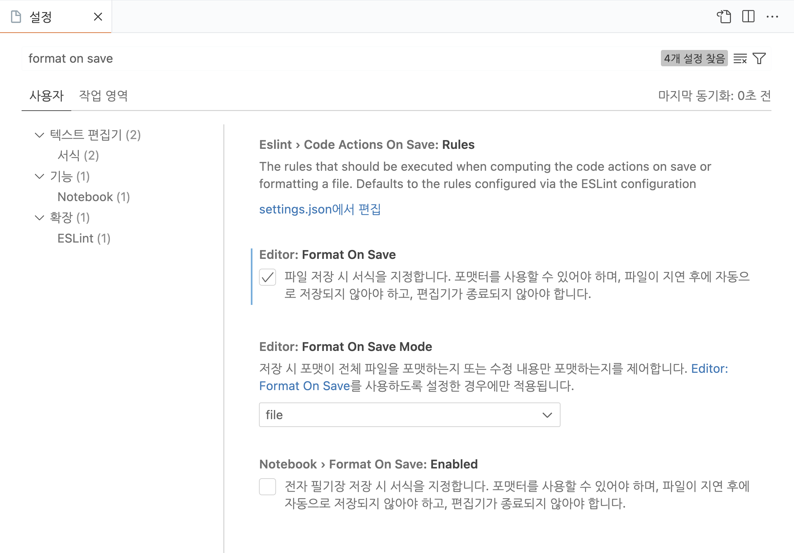

# ESLint와 Prettier 설정 하기

팀 프로젝트에서 뷰를 개발할 때 코드를 일관적으로 작성하고 에러를 덜 나게 하는 방법이 있습니다.
바로 ESLint + Prettier 플러그인을 사용하는 방법인데요.
이 2개 도구에 대한 자세한 설명과 설정 방법은 다음 글을 참고합니다.

- [Vue.js 개발 생산성을 높여주는 도구 3가지](https://joshua1988.github.io/web-development/vuejs/boost-productivity/)

## Vite 기반 Vue 3 프로젝트에서의 ESLint와 Prettier 설정 방법

Vue 3 공식 문서의 프로젝트 스캐폴딩(초기 환경 구성) 페이지에 안내된 프로젝트 생성 방법입니다.

```sh
npm init vue@latest
```

이 명령어를 입력하면 Vite 기반의 프로젝트가 생성됩니다. 프로젝트가 생성될 때 프로젝트 이름, 타입스크립트 설정 등을 묻는 9개의 질문이 나옵니다. 각 질문을 아래와 같이 답합니다.



생성된 프로젝트로 이동한 후 터미널(명령어 프롬프트 창)에 안내된 NPM 설치 명령어를 실행합니다. 설치가 완료된 후 VSCode의 설정에서 `Format on Save` 옵션을 켭니다.



마지막으로 main.js 파일에서 `mount('#app')` 코드 끝에 세미 콜론을 붙이고 파일을 저장하면 프리티어 규칙에 따라 세미 콜론이 자동으로 사라지는 것을 볼 수 있습니다.

::: tip
코드 포맷팅에 대한 자세한 설정은 [프리티어 공식 문서](https://prettier.io/docs/en/options.html)의 내용과 [Vue.js 개발 생산성을 높여주는 도구 3가지](https://joshua1988.github.io/web-development/vuejs/boost-productivity/) 문서를 참고하세요.
:::
