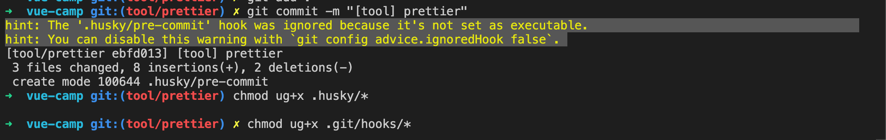

# Prettier 설정 하기

협업 시, 에러를 줄이고 일관적인 코드를 작성하기 위해 코드 포맷터 프리티어(Prettier)를 사용하는 방법이 있습니다.
Prettier를 프로젝트에 세팅하는 방법과 commit 전에 전체 코드를 대상으로 prettier를 실행해서 포맷팅 후에 commit을 하도록 하는 방법에 대해 알아보겠습니다.

## 포맷팅할 prettier 설정파일 생성하기

프로젝트 루트 디렉토리에서 `.prettierrc` 생성합니다.

```json
{
  "singleQuote": true,
  "semi": true,
  "useTabs": false,
  "tabWidth": 2,
  "trailingComma": "all",
  "printWidth": 120,
  "parser": "babel",
  "bracketSpacing": true,
  "arrowParens": "avoid"
}
```

:::tip
각 옵션에 대해 자세히 알고 싶다면 [prettier 공식 사이트](https://prettier.io/docs/en/options.html)를 참고하세요.
:::

## vscode에서 prettier 설치 및 실행하기

1. Extensions(mac : `command + shift + x`, window : `control + shift + x`)에서 Prettier를 설치합니다.

2. 설치가 완료되면 command + p를 누르고 `> Format Document`를 실행합니다.

## vscode에서 저장(command + s)시 자동으로 prettier 실행하기

1. command + ,를 누르고 검색에 `format on save`를 입력합니다.

2. `Editor: Format on Save`를 체크하고 vscode를 재부팅합니다.

3. 만약 저장시 포맷팅이 안된다면 다시 `command + ,`를 누르고 검색창에 `default formatter`를 검색하고 none으로 되어 있으면 Prettier - Code formatter로 변경 후 재부팅합니다.

## husky를 사용하여 commit 전에 prettier 전체 파일에 적용하기

허스키(husky)를 사용하면 Prettier를 설치하지 않아도 commit 전에 lint-staged에 설정된 파일 중에 변경된 파일을 대상으로 자동으로 포맷팅하여 commit 합니다.

:::tip
husky는 git hook을 쉽게 관리할 수 있는 도구입니다. git push, commit 등이 시행되기 전이나 후에 원하는 스크립트를 실행시켜줍니다.
더 자세한 내용을 알고 싶다면 [husky 공식 사이트](https://typicode.github.io/husky/)를 참고하세요.
:::

1. 위에서 설명드린 `포맷팅할 prettier 설정파일 생성하기`을 만듭니다.

2. 관련 라이브러리를 설치합니다.

```sh
yarn add -D husky@4 lint-staged prettier
```

3. package.json에 아래와 같이 추가합니다.

```json
{
  ...
  "scripts": {
    ...
    "init-husky": "npx husky install .husky",
    "lint-front": "lint-staged"
  },
  "lint-staged": {
    // 변경된 js, vue, json, md 파일을 대상으로 prettier를 실행합니다.
    "src/**/*.{js,json,md}": [
      "prettier --write",
      "git add"
    ]
  },
}

```

4. husky를 설치합니다.

```bash
yarn init-husky
```

이후 생성된 `.husky` 파일 하위에 `pre-commit`이라는 파일을 하나 생성하고 아래 코드를 넣습니다.

```bash
#!/bin/sh
. "$(dirname "$0")/_/husky.sh"

yarn lint-front

```

5. 이후 다른 파일을 변경하고 commit 하면 파일이 포맷팅 되어 commit 되는지 확인합니다.

6. 만약 아래와 같은 에러로 commit이 실패 한다면 터미널에 아래 코드를 넣습니다.



깃 훅 실행 권한을 부여하는 코드입니다.

```sh
chmod ug+x ./husky/*
chmod ug+x .git/hooks/*
```

7. vscode를 재부팅하고 다시 파일을 변경하여 commit 합니다.
