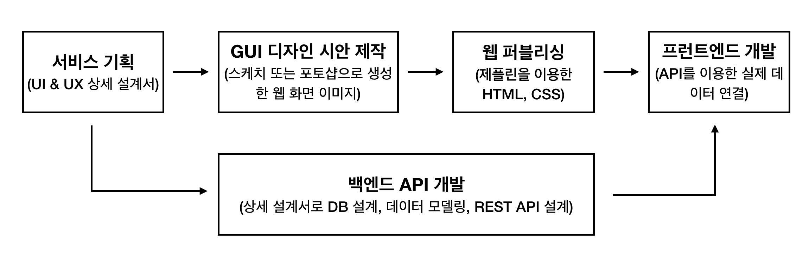

# 프런트엔드 개발 가이드

프런트엔드 개발자로서 알고 있어야 할 서비스 개발 절차, 역량 등에 대해서 알아봅니다.

## 웹 개발자 역할의 변화

최근 사용자 경험(User Experience)을 중시하는 웹이 대두되면서 웹 개발자의 역할을 다음과 같이 변화하였습니다.

- 예전 : 웹 개발자 (JSP, PHP + jQuery)
- 요즘 : 프런트엔드 (프런트엔드 프레임워크 사용) / 백엔드 (백엔드 프레임워크 사용)

위와 같은 변화가 일어난 까닭은 웹 사이트에서 풍부한 사용자 경험을 제공하기 위해 
많은 프런트엔드 기술과 도구가 등장함에 따라 웹 개발자가 소화해야 하는 지식이 많아졌기 때문입니다.
특히 화면에도 프레임워크가 생기면서 자연스럽게 화면 프레임워크를 다루는 프런트엔드 개발자와 
서버 프레임워크를 다루는 백엔드 개발자로 각각 전문화되었습니다.

## 현대 웹 서비스 개발 절차

프로젝트에 퍼블리셔와 디자이너가 있고 REST API를 사용하는 경우의 웹 서비스 개발 절차는 다음과 같습니다.



개인적인 경험상 API가 먼저 나와있는 상태에서 프런트엔드 개발을 했을 때 화면 개발이 더 쉽습니다. 개발 기간이 촉박할 때는 REST API가 나오기 전에 API의 명세서를 먼저 받아 가짜 데이터를 만들어 개발을 하고 추후에 다시 실제 데이터를 연결할 수도 있습니다. 하지만, 처음부터 실제 데이터를 연결하는 것이 프런트엔드의 작업량을 줄이는 지름길입니다.

::: tip
위의 절차는 회사나 서비스의 규모에 따라서 달라질 수 있습니다.
:::

## 프런트엔드 개발자에게 필요한 역량

현대 프런트엔드 프레임워크를 사용하는 프런트엔드 개발자에게 필요한 역량은 다음과 같습니다.

- (필수) API 호출과 자바스크립트 비동기 처리 능력
- (우대) API 문서를 읽는 능력과 백엔드 개발자와의 커뮤니케이션 역량
- (우대) REST API에 대한 이해
- (우대) CORS

각 항목에 대해서 좀 더 구체적으로 알아보겠습니다.

### (필수) API 호출과 자바스크립트 비동기 처리 능력

프런트엔드 개발 작업의 8할은 백엔드 개발자가 작성해준 API 문서를 읽고 각 화면에 맞는 API를 호출하여 데이터를 조작하는 일입니다. 따라서, API를 호출하기 위한 자바스크립트 비동기 처리 방법과 HTTP 프로토콜에 대한 이해가 높으면 높을수록 좋습니다. 해당 역량을 기르기 위해 다음과 같은 토픽들을 알고 계시면 좋습니다.

- 자바스크립트 비동기 처리 패턴
  - [Callback](https://joshua1988.github.io/web-development/javascript/javascript-asynchronous-operation/)
  - [Promise](https://joshua1988.github.io/web-development/javascript/promise-for-beginners/)
  - [Async & Await](es6/async-await.html)
- [HTTP 프로토콜](https://joshua1988.github.io/web-development/web-protocols/#http-hyper-text-transfer-protocol)
  - [크롬 개발자 도구의 Network 패널 사용법](https://developers.google.com/web/tools/chrome-devtools/network-performance/)
  - HTTP Request
  - HTTP Response

### (우대) API 문서를 읽는 능력과 백엔드 개발자와의 커뮤니케이션 역량

프런트엔드 개발자와 백엔드 개발자는 API 문서로 소통합니다. 따라서 백엔드 개발자는 API 문서를 잘 정리해서 작성하는 능력이 요구되고, 프런트엔드 개발자는 작성된 API 문서를 꼼꼼히 읽고 잘 파악하는 능력이 필요합니다. 개발한 API를 백엔드 개발자가 일일이 작성하는 곳도 있겠지만, 일반적으로 API 문서는 다음과 같은 API 문서 도구를 이용해서 자동으로 생성합니다.

- [Spring REST Doc](https://docs.spring.io/spring-restdocs/docs/2.0.3.RELEASE/reference/html5/)
- [Swagger](https://swagger.io/)

위 링크에 각각 공식 사이트 주소를 넣었습니다. 구글에 'spring rest doc', 'swagger' 라고 검색한 후 이미지로 검색을 해보시고 어떻게 생겼는지 정도만 보셔도 추후에 실무에서 사용하실 때 충분히 이해하실 수 있을 겁니다.

::: tip
API를 테스트할 때는 자바스크립트로 HTTP 요청을 날리는 방법도 있지만 객관적인 테스트를 위해 [Postman](https://www.getpostman.com/)이나 [Rest assured](http://rest-assured.io/)같은 API 테스트 도구를 사용하는 것을 추천드립니다 :)
:::

### (우대) REST API에 대한 이해

REST(Representational State Transfer) API는 클라이언트와 서버 간에 데이터를 주고받기 위한 URL 규칙입니다. 하이퍼 미디어(링크) 기반으로 특정 리소스나 데이터를 접근하기 위한 방식으로써 URL에 명시적으로 어떤 데이터를 담고 있는지 나타내어야 합니다. 

예를 들어 사용자의 목록을 받아오는 URL은 다음과 같습니다.

```
http://domain.com/api/users
```

여기서 첫 번째 사용자 데이터는 다음과 같이 접근할 수 있겠죠.

```
http://domain.com/api/users/1
```

REST API의 URL 규칙과 설계는 사실 프런트엔드 개발자가 알아야 할 영역은 아닙니다. 하지만, 화면 설계서를 보고 같이 데이터와 URL을 설계할 수 있으면 훨씬 더 능력 있는 프런트엔드 개발자가 될 수 있겠죠 :)

REST API에 대한 이해를 돕기 위해 참고할 만한 사이트를 몇 개 남깁니다.

[REST API 디자인 가이드 - 마이크로소프트](https://docs.microsoft.com/ko-kr/azure/architecture/best-practices/api-design?fbclid=IwAR3TZPok-d2vsIwMyguAGAzfJS8LK5qITS9a2PE5YeaJBtNsUCrtiFDfg74) <br>
[REST API 성숙도 모델](https://martinfowler.com/articles/richardsonMaturityModel.html) <br>
[REST API - 위키 백과](https://ko.wikipedia.org/wiki/REST)

### (우대) CORS

CORS(Cross-Origin Resource Sharing)는 현대 프런트엔드 프레임워크를 사용할 때 반드시 알아두면 좋은 브라우저의 기본 동작 방식입니다. 브라우저 보안상 브라우저에서는 특정 도메인에서 다른 도메인의 데이터를 접근하지 못하게 막습니다. 

이해하기 쉽게 그림으로 보겠습니다.


위 그림은 로컬 서버 두 대를 실행하고 한 로컬 서버에서 다른 로컬 서버로 HTTP 요청을 날리는 경우 CORS 동작에 의해 접근이 차단되는 것을 도식화하였습니다. 일반적으로 위와 같이 요청을 날리면 아래와 비슷한 에러 메시지가 출력됩니다.


CORS의 자세한 동작 방식과 해결 방법을 알고 있으면 좋습니다. 다음의 링크를 참고하셔서 학습하시면 좋겠네요.

- [CORS MDN](https://developer.mozilla.org/en-US/docs/Web/HTTP/CORS)
- [CORS Preflight란?](https://developer.mozilla.org/en-US/docs/Web/HTTP/CORS#Preflighted_requests)