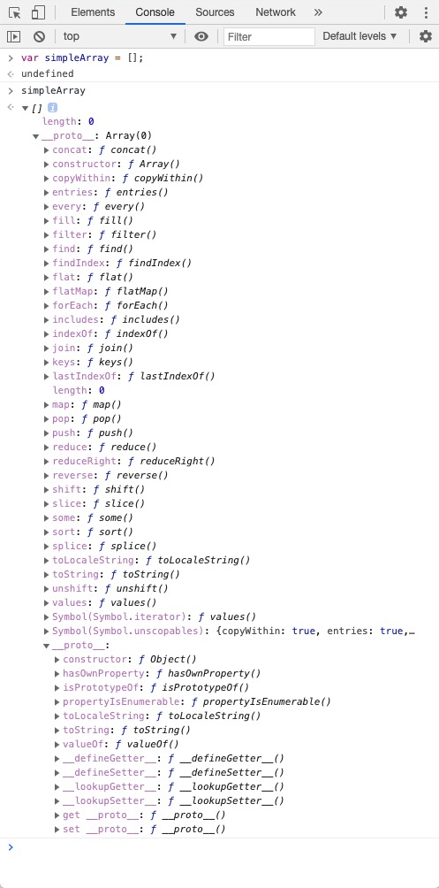
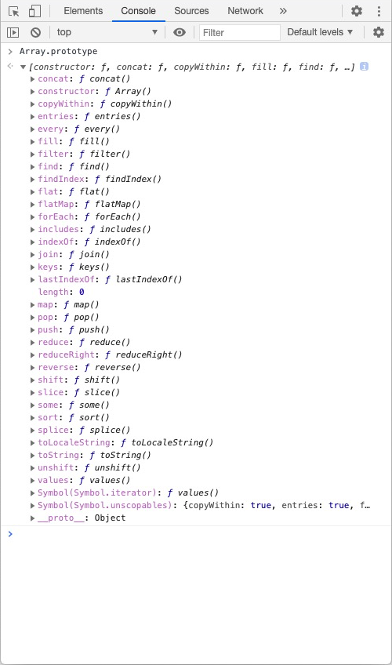
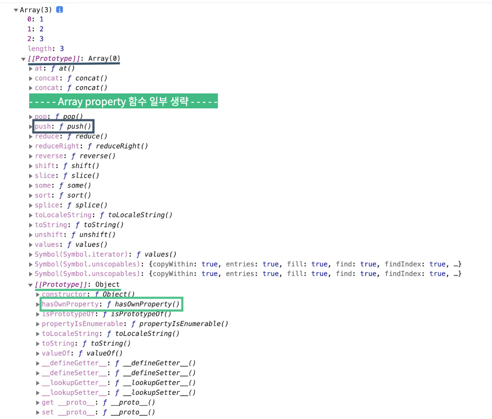

# 프로토타입 (Prototype)

자바스크립트는 **`프로토타입 기반 언어(prototype-based language)`** 입니다. 프로토타입 기반 언어에서는 어떤 객체를 원형(prototype)으로 삼고 이를 참조함으로써 상속과 비슷한 효과를 얻습니다.

자바스크립트의 프로토타입을 이해하기 위해서는 prototype 프로퍼티를 우선 이해해야 합니다. 간단한 예제로 시작해보겠습니다.

<br>
<br>
<br>

## prototye 개념 이해

브라우저의 개발자 도구에서 간단한 Array를 정의한 후 출력해보면 다음 화면과 같이 나옵니다.



출력된 결과를 보면 forEach, map, push와 같은 익숙한 함수들이 보입니다. 우리는 해당 함수를 정의하지 않았는데 그럼 어디에 함수들이 정의되어 있고, 어떻게 함수들을 쓸 수 있는 걸까요?

:::tip  
\_\_proto\_\_를 읽을 때는 'dunder proto'('던더 프로토')라고 읽으면 됩니다.
dunder는 'double underscore'의 줄임말  
:::

:::warning  
\_\_proto\_\_ 와 [[Prototype]]  
자바스크립트 명세에는 \_\_proto\_\_가 아닌 [[Prototype]]으로 정의되어 있으며,
\_\_proto\_\_ 프로퍼티는 단지 브라우저에서 [[Prototype]]을 구현한 대상이며 권장되는 방식이 아닙니다. 최신 브라우저 개발자 도구에서는 \_\_proto\_\_가 아닌 [[Prototype]]으로 표현될 수 있습니다. 본 문서에서는 이해하기 쉽게 하기 위하여 설명과 사진에 \_\_proto\_\_ 프로퍼티를 사용하였습니다.

참고 : ["프로토타입 상속" 문서 '\_\_proto\_\_는 [[Prototype]]용 getter·setter입니다.' 부분](https://ko.javascript.info/prototype-inheritance)  
:::

<br>
<br>

바로 위 예제에서 사용한 예제를 다르게 표현하면 다음의 new 키워드를 사용하는 문장과 동일합니다.

```javascript
// var simpleArray = [];
var simpleArray = new Array();
```

위 문장을 실행하면 일어나는 일을 순서대로 설명하면

1. 생성자 함수 Array를 new 키워드와 함께 호출하면
2. 생성자 함수 Array에 정의된 내용을 바탕으로 새로운 인스턴스 simpleArray가 생성됩니다.
3. 이때 생성된 인스턴스인 simpleArray에는 `__proto__` 라는 프로퍼티가 자동으로 부여되는데
4. `__proto__` 프로퍼티는 생성자 함수 Array의 `prototype` 프로퍼티를 참조합니다.

개발자 도구에서 다시 Array.prototype 을 출력해보면, 위에서 출력한 simpleArray의 \_\_proto\_\_ 프로퍼티의 내용과 동일한 것을 알 수 있습니다.



즉, 우리가 맨 처음 예제에서 봤던 forEach, map, push와 같은 함수들은 Array.prototype에 정의되어 있고, simpleArray 인스턴스의 \_\_proto\_\_ 프로퍼티에서 참조하고 있던 것입니다.

```javascript
Array.prototype === simpleArray.__proto__; //true
```

<br>

위 예제에서 알아본 `__proto__` 와 `prototype` 프로퍼티의 관계가 바로 자바스크립트 프로토타입 개념의 핵심입니다. prototype의 타입은 **객체**이고, prototype을 **참조**하는 \_\_proto\_\_ 또한 **객체**입니다. prototype 내부에는 **인스턴스가 사용할 메서드와 프로퍼티를 저장**합니다. 그럼 인스턴스에서 자동으로 생성한 \_\_proto\_\_ 프로퍼티를 통해 prototype 내부에 정의된 메서드와 프로퍼티를 사용할 수 있습니다.

<br>
<br>

다음으로 prototype 프로퍼티를 직접 사용하는 예제를 통해 prototype 프로퍼티를 더 이해해 보겠습니다

```javascript
function Person(name) {
  this.name = name;
}

Person.prototype.printName = function() {
  console.log(this.name);
};
```

<br>

위 코드를 보면 Person이라는 생성자 함수의 prototype에 `printName` 이라는 메서드를 지정하였습니다. 그럼 `Person`의 인스턴스는 \_\_proto\_\_ 프로퍼티를 통해 `printName` 함수를 호출할 수 있습니다.

```javascript
// ...

var ironMan = new Person("Tony Stark");
ironMan.__proto__.printName(); // undefined
```

위 예제를 보면 우리가 설정한 이름인 `'Tony Stark'`가 아닌 `undefined`를 출력합니다. 메서드를 출력할 때는 메서드 바로 앞의 객체가 this가 되는데, `ironMan.__proto__`에는 name이라는 프로퍼티가 존재하지 않아 `undefined`가 출력된 것입니다.

<br>

그럼 우리가 설정한 이름을 출력하려면 어떻게 해야 할까요?
원하는 결과를 얻기 위해 this를 `ironMan` 인스턴스로 설정하는 방법은 `__proto__` 없이 인스턴스에서 바로 `printName` 메서드를 사용하는 것입니다.

```javascript
// ...

var ironMan = new Person("Tony Stark");
ironMan.printName(); // Tony Stark

var captainAmerica = new Person("Steve Rogers");
captainAmerica.printName(); // Steve Rogers
```

<br>

위와 같이 실행할 수 있는 이유는 \_\_proto\_\_ 프로퍼티가 **생략 가능한 프로퍼티** 이기 때문입니다. \_\_proto\_\_ 프로퍼티를 생략할 수 있기 때문에 생성자 함수의 prototype에 어떤 메서드나 프로퍼티가 존재한다면 **인스턴스에서도 자신의 것처럼 해당 메서드나 프로퍼티를 접근** 할 수 있습니다.

```javascript
captainAmerica.__proto__.printName();
-> captainAmerica(.__proto__.)printName();
-> captainAmerica.printName();
```

<br>
<br>

### prototye 개념 정리

정리하면, 자바스크립트는 함수에 자동으로 `prototype` 이라는 객체 타입의 프로퍼티를 생성합니다. new 연산자와 함께 함수를 호출하여 함수를 생성자 함수로써 사용할 경우, 생성된 인스턴스에는 숨겨진 프로퍼티인 `__proto__` 프로퍼티가 자동으로 생성됩니다. 그리고 `__proto__` 프로퍼티는 생성자 함수의 `prototype` 프로퍼티를 **참조** 합니다. `__proto__` 프로퍼티는 **생략이 가능** 하기 때문에 인스턴스에서 생성자 함수의 `prototype`에 정의된 메서드나 프로퍼티에 **접근** 할 수 있습니다.

<br>
<br>
<br>

## 프로토타입 체인

### 메서드 오버라이드

인스턴스에서 생성자 함수의 prototype 프로퍼티를 참조하는 \_\_proto\_\_를 생략하면, 인스턴스는 prototype에 정의된 프로퍼티나 메서드를 자신의 것처럼 사용할 수 있다고 설명하였습니다. 그럼 만약 인스턴스에서 동일한 이름의 프로퍼티나 메서드를 가지고 있다면 어떨까요?

```javascript
function Person(name) {
  this.name = name;
}

Person.prototype.printName = function() {
  console.log(this.name);
};

var ironMan = new Person("Tony Stark");

//printName 메서드 오버라이드
ironMan.printName = function() {
  console.log(`I am ${this.name}`);
};

ironMan.printName(); // I am Tony Stark
```

위 예제는 위에서 사용 예제에서 `ironMan` 인스턴스에 `printName` 메서드를 다시 정의한 예제입니다. 실행 결과를 보면, `ironMan.__proto__.printName`이 아닌, `ironMan` 객체에 있는 `printName` 메서드가 호출되었습니다.

이와 같은 현상을 **`'메서드 오버라이드(method override)'`** 라고 합니다. **메서드 위에 메서드를 덮어씌웠다** 는 표현으로, 원본을 제거하고 다른 대상으로 교체한 것이 아닌 **원본 그대로 있는 상태에서 다른 대상을 위에 얹는** 개념입니다. 자바스크립트 엔진이 `printName`이라는 메서드를 찾는 방식은 먼저 실행 컨텍스트의 프로퍼티를 검색하고, 존재하지 않는다면 \_\_proto\_\_를 순차적으로 검색하는 순서로 진행하기 때문에 `ironMan` 객체에 있는 `printName` 메서드가 호출되었습니다.

<br>
<br>

### 프로토타입 체이닝

메서드 오버라이드에 대해 알아보았으니 맨 처음으로 돌아가 Array를 사용하는 예제를 다시 보겠습니다.

```javascript
var simpleArray = new Array(1, 2); //[1, 2]
simpleArray.push(3); //[1, 2, 3]
simpleArray.hasOwnProperty(2); // true
```

`simpleArray` 인스턴스에 push 함수와 hasOwnProperty 함수를 정의하지 않았지만, 위와 같이 사용할 수 있는 이유는 자바스크립트 엔진이 메서드를 찾는 방식이 프로퍼티를 검색하고, 존재하지 않는다면 그다음으로 가까운 대상인 \_\_proto\_\_를 검색하는 순서로 진행하기 때문입니다. 위 예제에서 `console.dir(simpleArray);` 명령을 실행해보면, push 함수와 hasOwnProperty 함수가 어디에 정의되어 있는지 확인 할 수 있습니다.



```javascript
simpleArray(.__proto__).push(3);
// simpleArray.__proto__ === Array.prototype // true

simpleArray(.__proto__)(.__proto__).hasOwnProperty();
// simpleArray.__proto__.__proto__ === Object.prototype // true
```

<br>

우리가 사용했던 함수들은 사실 위와 같이 `Array.prototype`에 정의된 push 함수와 `Object.prototype`에 정의된 hasOwnProperty 함수를 호출한 것입니다.

어떤 데이터의 \_\_proto\_\_ 프로퍼티 내부에 다시 \_\_proto\_\_ 프로퍼티가 연쇄적으로 이어진 것을 **`'프로토타입 체인(prototype chain)'`** 이라 하고, 이 체인을 계속 따라가며 검색하는 것을 **`'프로토타입 체이닝(prototype chaining)'`** 이라고 합니다.

<br>
<br>
<br>

## 자바스크립트 내장함수
