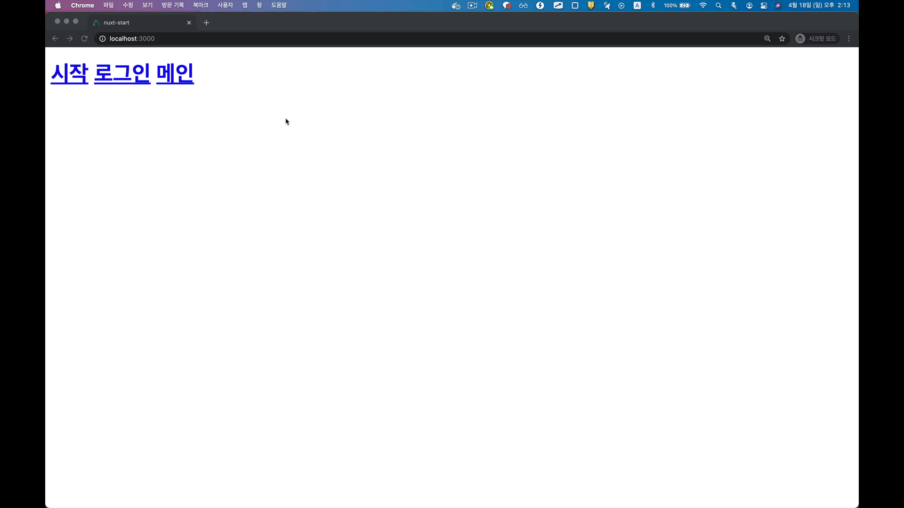

# Nuxt의 페이지 라우팅

뷰 싱글 페이지 애플리케이션에서는 라우터 설정을 아래와 같이 일일이 해줘야 하는데 반해 넉스트에서는 폴더와 파일 기반으로 라우터를 자동으로 생성해 줍니다.

```js
// 뷰 싱글 페이지 애플리케이션의 라우터 설정 파일
new VueRouter({
  routes: [
    {
      path: 'URL 주소',
      component: URL 주소에 접근했을 때 표시할 페이지 컴포넌트
    }
  ],
});
```

## 페이지 기반 라우터 자동 생성

넉스트에서 어떻게 파일과 폴더 기반으로 라우팅 할 수 있는지 살펴보겠습니다. 넉스트 프로젝트를 생성하면 `pages` 폴더가 존재하는데 그 아래에 다음과 같이 파일을 생성합니다.


위와 같이 파일을 생성하면 URL을 각각 `/`, `/login`, `/main`으로 접근했을 때 `index.vue`, `login.vue`, `main.vue` 컴포넌트가 화면에 표시됩니다. 이때 레이아웃 컴포넌트에 `<Nuxt/>`라는 태그가 있어야 합니다.

```html{4}
<!-- layouts/default.vue -->
<template>
  <div>
    <Nuxt />
  </div>
</template>
```

여기서 일일이 URL을 입력하여 들어가기엔 번거로우므로 아래와 같이 페이지 이동 링크인 `<NuxtLink to="/url주소">` 를 추가합니다.

```html{5-7}
<!-- layouts/default.vue -->
<template>
  <div>
    <h1>
      <NuxtLink to="/">시작</NuxtLink>
      <NuxtLink to="/login">로그인</NuxtLink>
      <NuxtLink to="/main">메인</NuxtLink>
    </h1>
    <Nuxt />
  </div>
</template>
```

이제 각 링크를 클릭하면 아래와 같이 동작합니다.



## 뷰 라우터와의 비교

위에서 살펴본 넉스트의 라우팅 방식을 뷰 라우터 방식과 비교하면 아래와 같습니다.

| Nuxt.js | VueRouter |
|-------|---------|
| `<Nuxt>`    | `<router-view>` |
| `<NuxtLink to="/">`     | `<router-link to="/">` |

이처럼 넉스트는 라우터 설정 파일을 일일이 생성 및 설정하지 않아도 되어 편리합니다.

:::tip
`<router-view>`, `<Nuxt>` 모두 뷰 컴포넌트입니다. 따라서 `<RouterView>`와 `<router-view>`와 같습니다. `<Nuxt>`도 그럼 동일한 케밥 네이밍으로 변환하면 `<nuxt>`로도 쓸 수 있겠죠? :)
:::