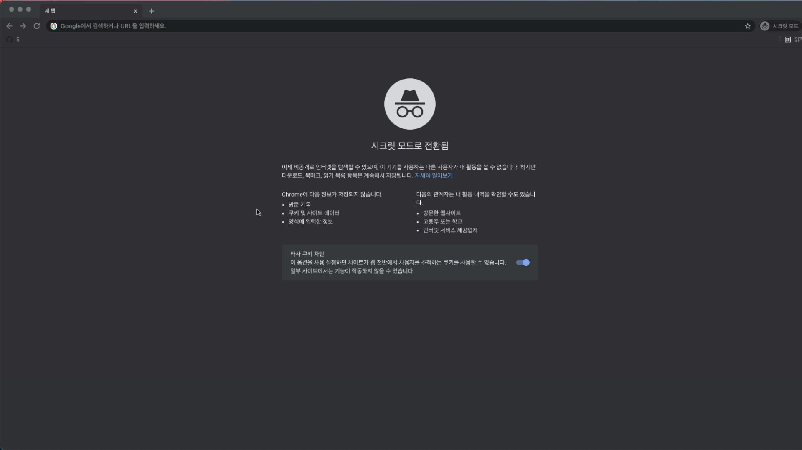

# Nuxt의 비동기 데이터 호출 방법

넉스트는 서버 사이드 렌더링 프레임워크이기 때문에 뷰 싱글 페이지 애플리케이션과 REST API를 호출하는 방식을 다르게 접근해야 합니다. 이 글에서는 기존 방식과의 차이점과 주의해야 할 점에 대해서 살펴보겠습니다.

## 싱글 페이지 애플리케이션과 다른 점

클라이언트 사이드 렌더링인 뷰 싱글 페이지 애플리케이션에서의 데이터 호출 방식은 아래와 같습니다.

```html
<!-- UserProfile.vue -->
<template>
  <div>
    <p>{{ user }}</p>
  </div>
</template>

<script>
import axios from 'axios';

export default {
  data() {
    return {
      user: {},
    }
  },
  methods: {
    async fetchUser() {
      const response = await axios.get('/users/1');
      this.user = response.data;
    }
  },
  created() {
    this.fetchUser();
  },
}
</script>
```

`created()` 라이프 사이클 훅을 이용해서 컴포넌트가 생성되자마자 서버에 데이터를 요청해 받아온 값을 화면에 표시하는 코드입니다. 이때 서버에 데이터를 요청하는 시점은 브라우저에서 Vue.js 코드가 화면의 DOM을 구성하고 스크립트를 실행하는 시점입니다. [클라이언트 사이드 렌더링과 서버 사이드 렌더링 차이점](../nuxt/ssr.html#서버-사이드-렌더링과-클라이언트-사이드-렌더링-차이점)의 그림에서도 볼 수 있지만 클라이언트 사이드 렌더링은 빈 화면을 브라우저가 받아 화면에 뿌릴 요소와 데이터를 모두 브라우저에서 구성하기 때문에 위와 같은 코드가 가능합니다.

하지만, 넉스트는 서버에서 페이지의 내용을 모두 그려서 브라우저로 가져가야 합니다. 그럼 어떻게 해야 할까요?

## 넉스트의 REST API 호출 방식

앞에서 살펴본 것처럼 싱글 페이지 애플리케이션에서 페이지에 데이터를 표시하기 위해서는 [뷰 라이프 사이클 훅](../vue/life-cycle.md)을 사용했습니다. 넉스트에서는 아래의 2가지 인스턴스 옵션 속성이 별도로 제공됩니다.

- `asyncData`
- `fetch`

## asyncData

`asyncData`는 페이지 컴포넌트(pages 폴더 아래에 위치하는 컴포넌트)에만 제공되는 속성입니다. `asyncData`로 아래와 같이 서버 데이터를 호출할 수 있습니다.

```html
<!-- pages/user.vue -->
<template>
  <div>
    <p>{{ user }}</p>
  </div>
</template>

<script>
import axios from 'axios';

export default {
  // params의 id가 1이라고 가정
  async asyncData({ params, $http }) {
    const response = await axios.get(`/users/${params.id}`);
    const user = response.data;
    return { user }
  }
}
</script>
```

위 코드는 URL `/user`로 접근할 때 `user.vue` 컴포넌트를 화면에 그리기 전에 데이터를 요청하는 코드입니다. 데이터를 다 받아와야지만 데이터를 들고 `<template></template>` 영역의 코드를 화면에 표시합니다. 마치 싱글 페이지 애플리케이션의 뷰 라우터에서 네비게이션 가드에서 데이터를 호출하고 받아왔을 때 페이지를 진입하는 것과 같습니다.

:::tip
라우터 네비게이션 가드의 데이터 호출 방법은 아래 영상을 참고하세요 :) <br>
[Vue.js 완벽 가이드 - 라우터 네비게이션 데이터 호출 방법](https://www.inflearn.com/course/vue-js/lecture/17055)
:::

<!-- TODO: 이후 강의 개시 시점에 아래 코드 노출 -->
```js
// router/index.js
new VueRouter({
  routes: [
    {
      path: '/login',
      component: login,
      async beforeEnter(to, from, next) {
        const response = await axios.get(`/users/${params.id}`);
        store.commit('setUser', response.data);
        next();
      }
    }
  ]
})
```

## asyncData의 에러 핸들링

aysncData 속성에서 API 호출 에러가 발생했을 때는 아래와 같이 에러 페이지로 이동시킬 수 있습니다.

```js
export default {
  async asyncData({ params, $http, error }) {
    try {
      const response = await axios.get(`/users/${params.id}`);
      const user = response.data;
      return { user }
    } catch(e) {
      error({ statusCode: 503, message: 'API 요청이 실패했습니다 다시 시도해 주세요' })
    }
  }
}
```

## fetch

`fetch`는 페이지 컴포넌트 뿐만 아니라 일반 뷰 컴포넌트에서도 사용할 수 있는 데이터 호출 속성입니다. 다음 2가지 상황에서 호출됩니다.

- 서버 사이드 렌더링을 위해 서버에서 화면을 구성할 때 컴포넌트가 생성되고 나서 실행됨
- 브라우저에서 URL 주소를 변경해서 페이지를 이동할 때

간단한 예제 코드를 보겠습니다.

```html
<!-- components/UserProfile.vue -->
<template>
  <div>{{ user }}</div>
</template>

<script>
import axios from 'axios';

export default {
  data() {
    return {
      user: {},
    }
  },
  async fetch() {
    const res = await axios.get('https://jsonplaceholder.typicode.com/users/1');
    this.user = res.data;
  },
}
</script>
```

만약 위 컴포넌트가 아래와 같이 `main.vue` 컴포넌트에 등록되어 있고 URL 주소가 `/`에서 `/main`으로 변경되면 컴포넌트가 화면에 부착되고 나서(mounted) `fetch` 안의 데이터 호출 로직이 실행됩니다.

```html
<!-- pages/main.vue -->
<template>
  <div>
    <h1>메인 페이지</h1>
    <UserProfile></UserProfile>
  </div>
</template>

<script>
import UserProfile from '@/components/UserProfile.vue'

export default {
  components: {
    UserProfile,
  },
}
</script>
```


위의 동작에서 볼 수 있듯이 최초에 `/`로 접근하고 `/main`으로 이동했기 때문에 컴포넌트가 화면에 먼저 뿌려지고 나서 `fetch` 호출이 실행됩니다. 따라서, `/main`으로 이동하고 나면 데이터를 받아오는 동안 `user` 속성의 기본 값인 `{}`가 먼저 화면에 보이고 잠시 후에 받아온 데이터가 화면에 그려지는 걸 볼 수 있습니다.

여기서 만약 최초로 웹 서비스를 `/main`으로 접근하게 되면 서버에서 화면을 구성할 때 호출됩니다. 따라서, **화면에 데이터가 호출된 상태로 페이지가 표시됩니다.**



## fetch 특징

`fetch`는 `asyncData`와 다르게 아래와 같은 속성들을 제공합니다.

- `$fetchState` : 데이터 호출 상태를 나타내는 속성이며 인스턴스로 접근할 수 있습니다. 호출 상태에 따라 `pending`, `error`, `timestamp`를 제공합니다.
- `$fetch` : `fetch` 로직을 다시 실행시킬 수 있는 함수입니다.
- `fetchOnServer` : 서버 사이드 렌더링 시에 서버에서 `fetch`를 실행할지 말지 결정하는 속성입니다. 기본값은 `true` 입니다.

위 속성을 코드로 살펴보겠습니다.

```html{4,5,8,23-24,31-32}
<template>
  <div>
    <article>
      <p v-if="$fetchState.pending">사용자 API 호출 중</p>
      <p v-else-if="$fetchState.error">에러가 발생했습니다</p>
      <div v-else>{{ user }}</div>
    </article>
    <button @click="fetchUser">다시 호출하기</button>
  </div>
</template>

<script>
import axios from 'axios';

export default {
  data() {
    return {
      user: {},
    }
  },
  methods: {
    fetchUser() {
      // fetch 속성의 로직을 실행합니다.
      this.$fetch();
    }
  },
  async fetch() {
    const res = await axios.get('https://jsonplaceholder.typicode.com/users/1');
    this.user = res.data;
  },
  // 아래 속성을 'false'로 바꾸면 서버에서 화면을 구성할 때 `fetch` 속성의 로직이 실행되지 않습니다.
  fetchOnServer: false
}
</script>
```