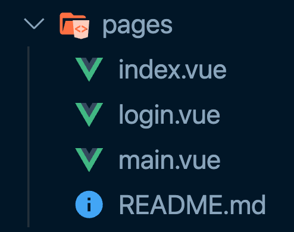
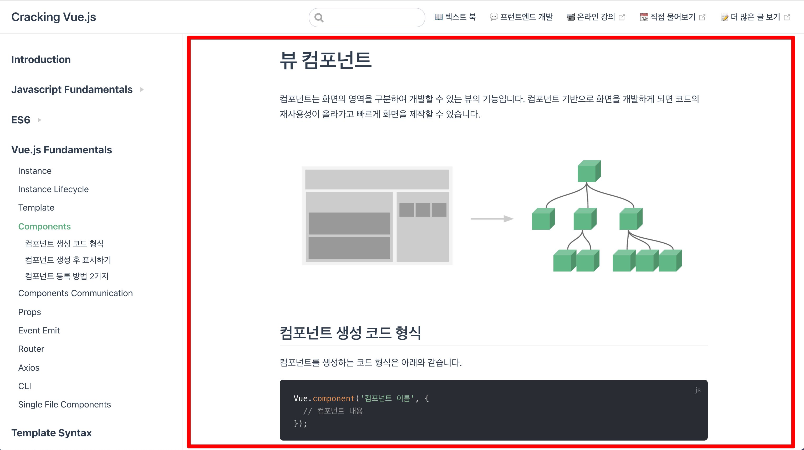
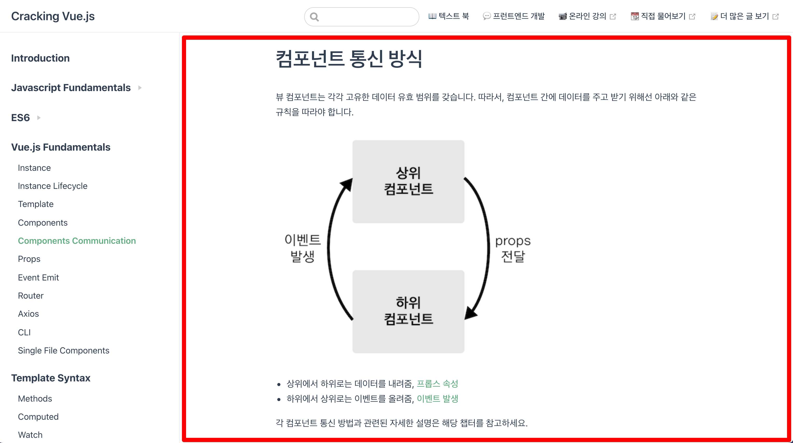

# Nuxt의 레이아웃 컴포넌트

레이아웃 컴포넌트란 페이지의 레이아웃을 잡아주는 역할을 하는 컴포넌트를 의미합니다.

## 레이아웃 컴포넌트 소개

nuxt 프로젝트를 생성하고 나서 아래와 같이 페이지 컴포넌트를 추가하고 나면 `layouts/default.vue` 컴포넌트가 페이지의 레이아웃을 구성해 줍니다.



URL에 `/login`과 `/main`을 각각 접근하면 `login.vue` 컴포넌트와 `main.vue` 컴포넌트에 정의된 내용이 화면에 표시될 것입니다. 이 때 코드가 아래와 같다고 가정하겠습니다.

```html
<!-- login.vue -->
<template>
  <div>
    <h1>login 페이지</h1>
    <form></form>
  </div>
</template>
```

```html
<!-- main.vue -->
<template>
  <div>
    <h1>main 페이지</h1>
    <main></main>
  </div>
</template>
```

이제 각 URL로 접근하면 기본적으로 화면에 표시되는 컴포넌트는 `layouts/default.vue` 컴포넌트입니다.

```html{4}
<!-- default.vue -->
<template>
  <div>
    <Nuxt />
  </div>
</template>
```

위 컴포넌트의 `<Nuxt/>`가 바로 특정 URL에 해당하는 페이지 컴포넌트를 뿌리는 영역입니다. `/login`과 `/main`은 각각 아래와 같이 표시될 것입니다.

```html{4}
<!-- '/login'에 접근하는 경우 -->
<template>
  <div>
    <!-- 로그인 컴포넌트 내용 -->
  </div>
</template>
```

```html{4}
<!-- '/main'에 접근하는 경우 -->
<template>
  <div>
    <!-- 메인 컴포넌트 내용 -->
  </div>
</template>
```

이 때 페이지마다 반복되는 UI 영역인 헤더를 레이아웃 컴포넌트에 아래와 같이 정의할 수 있습니다.

```html{4}
<!-- default.vue -->
<template>
  <div>
    <h1>{{ $route.name }} 페이지</h1>
    <Nuxt />
  </div>
</template>
```

이제 각 페이지 컴포넌트(page 폴더에 있는 컴포넌트)에는 헤더 내용을 작성하지 않고 바로 해당 페이지의 UI 요소에 집중할 수 있습니다.

```html{3}
<!-- login.vue -->
<template>
  <form></form>
</template>
```

```html{3}
<!-- main.vue -->
<template>
  <main></main>
</template>
```

## 커스텀 레이아웃

앞에서 다룬 기본 레이아웃 `default.vue` 이외에도 다른 레이아웃을 정의하고 사용할 수 있습니다. 먼저 레이아웃 폴더에 새로운 뷰 파일을 하나 생성합니다.

```html
<!-- layouts/blog.vue -->
<template>
  <div>
    <nav>네비게이션 영역</nav>
    <Nuxt />
  </div>
</template>
```

이제 위 레이아웃을 사용할 페이지 컴포넌트에서 아래와 같은 속성을 추가합니다.

```js
// pages/main.vue
export default {
  layout: 'blog'
}
```

<!-- TODO: 다른 내용 먼저 작성 후 이후에 시간 될 때 작성 -->
<!-- ## 에러 페이지 -->

<!-- ## 싱글 페이지 애플리케이션에서의 레이아웃 컴포넌트 패턴

현재 보고 있는 사이트를 예시로 들어보겠습니다. 현재 사이트에서 좌측 메뉴를 선택하면 아래와 같이 본문의 내용만 변경됩니다.

- URL `/components` 로 접근하거나 좌측 `Components` 메뉴를 선택했을 때 화면



- URL `/components-communication` 로 접근하거나 좌측 `Components Communication` 메뉴를 선택했을 때 화면



여기서 만약 레이아웃 컴포넌트를 쓰지 않는다면 현재 사이트가 싱글 페이지 애플리케이션 구조라고 가정했을 때 아래와 같은 컴포넌트 구조를 갖게 될 것입니다.

```html
<template>
  <div>
    <AppHeader></AppHeader>
    <SideMenu></SideMenu>
    <router-view></router-view>
  </div>
</template>
```

메뉴를 클릭할 때마다 주소가 `/components`, `/components-communication` 로 바뀔 것이고 이에 따라 `router-view` 컴포넌트는 각 본문 내용을 담고 있는 컴포넌트를 표시할 것입니다.

이 때 페이지 레이아웃 컴포넌트를 적용한다면 코드 구조는 아래와 같이 변경됩니다. -->

