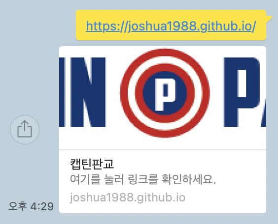

# 페이지 메타 정보 설정

넉스트에서 페이지의 메타(meta) 태그 정보를 설정하는 방법에 대해 알아봅니다.

## 페이지 head 태그 설정

넉스트로 제작된 애플리케이션의 head 태그 값은 기본적으로 넉스트 설정 파일에 정의되어 있습니다.

```js
// nuxt.config.js
export default {
  head: {
    title: 'learn-nuxt',
    htmlAttrs: {
      lang: 'en',
    },
    meta: [
      { charset: 'utf-8' },
      { name: 'viewport', content: 'width=device-width, initial-scale=1' },
      { hid: 'description', name: 'description', content: '' },
    ],
    link: [{ rel: 'icon', type: 'image/x-icon', href: '/favicon.ico' }],
  },
}
```

위 코드가 적용된 페이지는 브라우저에 그려졌을 때 다음과 같은 HTML 코드로 변환됩니다.

```html
<html lang="en">
<head>
  <title>페이지 타이틀입니다</title>
  <meta data-n-head="ssr" charset="utf-8">
  <meta data-n-head="ssr" name="viewport" content="width=device-width, initial-scale=1">
  <meta data-n-head="ssr" data-hid="description" name="description" content="">
  <link data-n-head="ssr" rel="icon" type="image/x-icon" href="/favicon.ico">
</head>
<!-- ... -->
```

이 설정은 모든 페이지에 동일하게 적용됩니다. 여기서 페이지별로 다른 head 태그를 설정하고 싶다면 어떻게 해야 할까요?

## 페이지별 head 태그 설정

페이지별로 다른 head 태그를 설정하고 싶은 경우에는 각 페이지 컴포넌트에 아래와 같은 속성을 추가합니다.

```html
<!-- page/home.vue -->
<script>
export default {
  data() {
    return {
      str: 'hi'
    }
  },

  head: {
    title: '페이지 타이틀',
    meta: [
      {
        hid: 'description',
        name: 'description',
        content: '페이지 설명 내용',
      },
    ],
    link: [
      {
        rel: 'stylesheet',
        href: 'https://fonts.googleapis.com/css?family=Roboto&display=swap'
      }
    ]
  },
}
</script>
```

만약 컴포넌트에 정의되어 있는 뷰 인스턴스 데이터나 컴퓨티드 속성을 메타 태그에 값으로 연결하고 싶다면 아래와 같이 함수 형태로 작성합니다.

```html
<!-- pages/products/_id.vue -->
<script>
export default {
  data() {
    return {
      productName: '바삭한 과자'
    }
  },

  head() {
    return {
      title: `상품 상세 페이지 - ${this.productName}`
    }
  },
}
</script>
```

기타 meta 태그 설정 방법에 대해서는 아래 문서를 참고합니다.

- [Meta Tags and SEO](https://nuxtjs.org/docs/2.x/features/meta-tags-seo)
- [vue-meta 속성](https://vue-meta.nuxtjs.org/api/#metainfo-properties)

## Open Graph 태그 설정

OG(Open Graph) 태그란 특정 페이지의 링크를 SNS 상에서 공유할 때 해당 페이지의 정보가 잘 드러날 수 있도록 지원해 주는 메타 태그입니다.



위와 같이 페이스북이나 카카오톡 등 SNS 상으로 특정 링크를 공유하면 해당 페이지의 title, description, image 등의 사이트 정보를 바로 확인할 수 있습니다. 앞에서 안내한 `head` 속성을 이용해 페이지 별로 다음과 같이 정의합니다.

```html
<script>
export default {
  head: {
    title: '상품 상세 페이지',
    meta: [
      {
        hid: 'og:title',
        property: 'og:title',
        content: '상품 상세 페이지'
      },
      {
        hid: 'og:description',
        property: 'og:description',
        content: '상품의 상세 정보를 확인해보세요'
      },
      {
        hid: 'og:image',
        property: 'og:image',
        content: 'http://placeimg.com/640/480/fashion'
      },
    ]
  }
}
</script>
```

OG 태그의 추가적인 속성들은 아래 공식 문서를 참고하세요 :)

[Open Graph Protocol](https://ogp.me/)