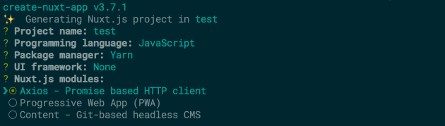
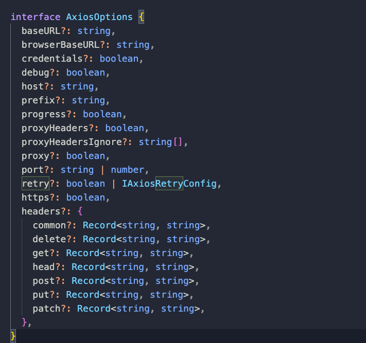

# Axios for Nuxt

[@nuxtjs/axios](https://axios.nuxtjs.org) 모듈은 Nuxt와 연동해서 엑시오스([Axios](/vue/axios))를 사용할 수 있도록 인터페이스를 제공하고 있습니다. 앞으로 이 글에서 언급될 `$axios`는 Nuxt용 엑시오스 인스턴스를 뜻합니다.

## 주요 특징

- 옵션을 통해 런타임 환경(서버, 클라이언트)에 따라 사용할 기본 URL(Base URL)을 지정할 수 있습니다.
- 옵션을 통해 [@nuxtjs/proxy](https://www.npmjs.com/package/@nuxtjs/proxy)와 연계하여 프록시([Proxy](https://joshua1988.github.io/webpack-guide/devtools/webpack-dev-server.html#프록시-proxy-설정))를 쉽게 허용할 수 있습니다.
- 옵션을 통해 [axios-retry](https://www.npmjs.com/package/axios-retry)와 연계하여 비동기 요청 실패에 따른 재전송 옵션을 쉽게 설정할 수 있습니다.
- Nuxt의 프로그레스 바([Progress Bar](https://nuxtjs.org/docs/2.x/features/loading#customizing-the-progress-bar))와 자동으로 연동됩니다.
- 헬퍼 메서드를 통해 `$axios`의 인터셉터, 토큰, 헤더, 기본 URL을 쉽게 설정할 수 있습니다.
- 플러그인을 통해 커스텀 `$axios`를 Vue 인스턴스에 주입(Inject) 할 수 있습니다.

## 설치 및 등록

Nuxt 프로젝트를 설치할 때 아래와 같이 Axios 옵션을 선택하면 패키지 설치부터 모듈 등록까지 자동으로 진행됩니다.



이미 프로젝트를 설치한 상태라면 아래의 방법으로 패키지 설치와 모듈 등록을 진행하시면 됩니다.

```bash
npm install @nuxtjs/axios
```

```js
// nuxt.config.js
export default {
  modules: ["@nuxtjs/axios"],
};
```

## 기본 활용법

패키지 설치와 모듈 등록이 끝나면 [VueComponent](/vue/components.html) 인스턴스와 [context](/nuxt/data-fetching.html#asyncdata의-파라미터)에 등록이 되므로 아래와 같이 사용할 수 있습니다.

```js
<script>
export default {
    async asyncData({ $axios }){
        const { data } = await $axios.get(...);
        ...
    },
    async fetch(){
        const { data } = await this.$axios.get(...);
        ...
    },
}
</script>
```

:::tip
`$axios` 응답(Response) 값에 `data` 구조 분해 할당이 번거로울 경우, 아래와 같이 `$axios`의 요청(Request) 메서드 앞에 `$`를 붙여서 편리하게 `data` 속성 값을 받아 올 수 있습니다. [참조](https://axios.nuxtjs.org/usage#-shortcuts)

```js
async fetch(){
    console.log(
        JSON.stringify(await this.$axios.$get('/products'))
        === JSON.stringify((await this.$axios.get('/products')).data)
    ) // true
}
```

:::

## 옵션

Nuxt 설정 파일에 옵션을 명시하여 `$axios`의 환경 설정(Configuration)을 할 수 있습니다. 본문에서는 자주 쓰이는 옵션들 위주로 설명하겠습니다.

:::tip
`$axios`의 환경 설정은 총 두 차례에 걸쳐 일어납니다. Nuxt 설정 파일을 통해서 설정이 우선 적용되고 두 번째로는 [플러그인](/nuxt/nuxt-axios.html#플러그인)을 통해 설정이 추가 적용됩니다.
:::

### Host, Port, Prefix

호스트(Host), 포트(Port), 프리픽스(Prefix)는 이후에 언급할 `baseURL`과 `browserBaseURL`의 디폴트 값에 사용되는 값입니다. 아래와 같이 Nuxt 설정 파일에 명시할 수 있습니다.

```js
// nuxt.config.js
export default {
  // $axios의 baseURL을 https://example.com:9000/로 설정
  axios: {
    host: "https://example.com",
    port: "9000",
    prefix: "/",
  },
};
```

또는 환경 변수에 `API_HOST`, `API_PORT`, `API_PREFIX`로 값을 지정할 수 있습니다.

```js
// .env
API_HOST=https://example.com
API_PORT=9000
API_PREFIX=/
```

### BaseURL

`$axios`의 `baseURL` 속성은 서버 사이드에서 요청을 보낼 때 기본 URL이 되는 값입니다. 디폴트 값은 http://\[HOST\]:\[PORT\]\[PREFIX\] 값으로 위에서 언급했던 호스트, 포트, 프리픽스가 사용됩니다. 또는 아래와 같이 직접 `baseURL`을 지정할 수 있습니다.

```js
// nuxt.config.js
export default {
  axios: {
    baseURL: "http://localhost:8080/modules",
  },
};
```

또는 환경 변수에 `API_URL`로 값을 지정할 수 있습니다.

```js
// .env
API_URL=http://localhost.com:8080/modules
```

### BrowserBaseURL

`browserBaseURL` 속성은 클라이언트 사이드에서 요청을 보낼 때 기본 URL이 되는 값입니다. 위에서 언급한 `baseURL`을 디폴트 값으로 가집니다. 아래와 같이 직접 `browserBaseURL`을 지정할 수 있습니다.

```js
// nuxt.config.js
export default {
  axios: {
    browserBaseURL: "https://learnNuxt.com:8080/modules",
  },
};
```

또는 환경 변수에 `API_URL_BROWSER`로 값을 지정할 수 있습니다.

```js
// .env
API_URL_BROWSER=https://learnNuxt.com:8080/modules
```

### Proxy

`@nuxtjs/axios`를 설치하면 의존성(Dependency)에 의해서 자동으로 [`@nuxtjs/proxy`](https://www.npmjs.com/package/@nuxtjs/proxy)가 설치됩니다. 다음과 같이 `axios.proxy`를 `true`로 설정하면 `$axios`의 프록시 사용이 가능해집니다.

```js
// nuxt.config.js
export default {
  axios: {
    proxy: true,
  },

  proxy: {
    "/api/": "http://api.example.com",
    "/api2/": "http://api.another-website.com",
  },
};
```

### Retry

`@nuxtjs/axios`를 설치하면 의존성에 의해서 자동으로 [`axios-retry`](https://www.npmjs.com/package/axios-retry)가 설치됩니다. 이 모듈을 적용하면 `$axios` 요청 실패 시 자동으로 결과를 가로채서 다시 요청을 보냅니다. Nuxt 설정 파일의 `axios.retry`를 `true`로 설정하거나 [`retryOptions`](https://www.npmjs.com/package/axios-retry#options)를 지정하면 요청 실패에 따른 자동 재요청이 가능해집니다. 참고로 재전송 횟수의 디폴트는 3회입니다.

```js
// nuxt.config.js
export default {
  axios: {
    retry: {
      retries: 4, // 최대 재전송 횟수 4회
      shouldResetTimeout: true, // 재전송 간 타임아웃을 리셋하기
      retryDelay: (retry) => {
        return retry * 100; // 재전송 횟수 * 0.1초만큼 재전송 시작 시간을 지연시키기
      },
      retryCondition: (error) => err.response.status === 429, // 서버 혼잡이 일어났을 경우에만 재전송하기
    },
  },
};
```

### Progress

Nuxt의 프로그레스 바(Progress Bar)에 연동해서 요청 동안 로딩 바(Loading Bar)를 보여줍니다. 이 설정은 디폴트로 설정되어 있기 때문에 로딩 바를 보여주고 싶지 않다면 Nuxt 설정 파일에 이를 명시해야 합니다.

```js
// nuxt.config.js
export default {
  axios: {
    progress: false, // 로딩 바를 사용하지 않음
  },
};
```

개별 요청에만 적용하고 싶다면 다음과 같이 사용합니다.

```js
this.$axios.$get("...", { progress: false });
```

### 그 외 옵션

위에서 언급되지 않은 옵션들은 아래의 타입과 [공식 문서](https://axios.nuxtjs.org/options)를 참조해 주세요.



## 헬퍼 메서드

`$axios`의 기본 URL, 헤더, 토큰, 인터셉터를 설정하기 위해서 네 종류의 헬퍼 메서드가 제공됩니다. 이번 섹션에서는 기본 URL, 헤더, 토큰을 설정하는 메서드만 다루고 인터셉터 관련 메서드는 플러그인 섹션의 [인터셉터 추가하기](/nuxt/nuxt-axios.html#인터셉터-추가하기)에서 다뤄보겠습니다.

### setBaseURL

`$axios`의 기본 URL을 설정합니다.

```js
// 클라이언트, 서버 모두에서 사용할 수 있는 기본 URL 설정
$axios.setBaseURL("http://api.example.com");

// 클라이언트 사이드에서만 사용할 수 있는 기본 URL 설정
if (process.client) {
  $axios.setBaseURL("http://api.example.com");
}

// 서버 사이드에서만 사용할 수 있는 기본 URL 설정
if (process.server) {
  $axios.setBaseURL("http://api.example.com");
}
```

### setHeader

`$axios`의 요청 헤더를 설정합니다.

```js
// $axios로 요청을 보낼 때마다 헤더에 'Authorizaion : 123'이 등록됨
$axios.setHeader("Authorization", "123");

// 'Authorization' 헤더에 새로운 값 덮어쓰기
$axios.setHeader("Authorization", "456");
```

### setToken

`$axios`의 요청 헤더인 `Authorization` 값을 설정합니다.

```js
// $axios로 요청을 보낼 때마다 헤더에 'Authorizaion : 123'이 등록됨, 새로운 값으로 덮어쓰기도 가능
$axios.setToken("123");

// 토큰의 인증 스킴 지정 가능, 'Authorization : Bearer 123'이 등록됨
$axios.setToken("123", "Bearer");

// 토큰을 첨부할 요청 메서드 선택 가능, post, put, delete 요청을 보낼 경우만 헤더에 'Authorization : Bearer 123'이 등록됨
$axios.setToken("123", "Bearer", ["post", "put", "delete"]);
```

:::warning
`$axios`의 설정을 바꿀 경우 글로벌하게 적용되므로 의도치 않은 동작을 막기 위해 헬퍼 메서드를 컴포넌트에서 활용하기보단 [플러그인](/nuxt/nuxt-axios.html#플러그인)에서 활용하는 것을 추천합니다.
:::

## 플러그인

플러그인을 통해 `$axios`의 헬퍼 메서드로 설정을 추가/변경하거나, 새로운 엑시오스 인스턴스를 생성해서 Nuxt에 주입할 수 있습니다.
Nuxt의 등록된 `$axios`를 활용하기 위해서는 Nuxt 설정 파일의 `plugins` 속성에 `$axios`를 조작할 자바스크립트 파일을 등록해야 합니다.

### 설정 변경하기(overwrite)

참고로 `$axios`는 옵션에 명시한 설정이 이미 적용된 상태이고 플러그인을 통해 기존의 설정을 변경할 수 있습니다. 아래는 그 예시입니다.

```js
// nuxt.config.js
export default {
  plugins: ["@/plugins/api"],
  axios: {
    baseURL: "http://localhost:5000",
  },

  publicRuntimeConfig: {
    axios: {
      browserBaseURL: "http://localhost:4000",
    },
  },

  privateRuntimeConfig: {
    axios: {
      baseURL: "http://localhost:3000",
    },
  },
};
```

```js
// plugins/api.js
export default function({ $axios }) {
  if (process.server) {
    $axios.setBaseURL("http://localhost:8000");
  }
  if (process.client) {
    $axios.setBaseURL("http://localhost:9000");
  }
}
```

옵션으로 기본 URL을 설정하더라도 플러그인을 통해 변경이 가능합니다. 위의 예시에서는 최종적으로 클라이언트 사이드에서 `$axios`의 기본 URL은 포트 8000번이 되고 서버 사이드에서는 포트 9000번이 됩니다.

### 인터셉터 추가하기

비동기 데이터 통신 과정에서 요청 발생, 응답 수신 등에 반응하여 함수를 호출하는 인터셉터를 추가할 수 있습니다. 아래는 인터셉터에 사용될 수 있는 헬퍼 메서드들의 예입니다. 헬퍼 메서드들에 함수를 등록해두면 특정 상황 발생 시 함수를 호출합니다.

- `onRequest(config => {...})` : 요청이 발생하면 함수 호출
- `onResponse(response => {...})` : 응답을 수신하면 함수 호출
- `onError(error => {...})` : 요청/응답 상관없이 에러가 발생하면 함수 호출
- `onRequestError(error => {...})` : 요청 실패가 발생하면 함수 호출
- `onResponseError(error => {...})` : 응답 실패가 발생하면 함수 호출

아래는 인터셉터 추가 예시입니다.

```js
// plugins/api.js
export default function({ $axios, redirect }) {
  $axios.onRequest((config) => {
    console.log("Making request to " + config.url); // 요청 때마다 url 출력
  });

  $axios.onError((error) => {
    const code = parseInt(error.response && error.response.status);
    if (code === 400) {
      redirect("/400"); // 400 에러 발생시 /400으로 리다이렉트
    }
  });
}
```

### 커스텀 axios 인스턴스 주입

엑시오스 인스턴스를 새로 생성해서 `$axios`처럼 `context`나 `VueComponent` 인스턴스에서 사용할 수 있도록 엑시오스 인스턴스를 주입할 수 있습니다.

```js
// plugins/api.js
export default function({ $axios }, inject) {
  // 새로운 엑시오스 인스턴스 생성
  const api = $axios.create({
    headers: {
      common: {
        Accept: "text/plain, */*",
      },
    },
  });

  // 인스턴스의 기본 URL 변경
  api.setBaseURL("https://my_api.com");

  // context에 주입, $api 형태로 호출 가능
  inject("api", api);
}
```

위와 같이 플러그인을 통해 `$api`를 주입하면 아래와 같이 사용이 가능해집니다.

```js
<script>
export default {
    async asyncData({ $api }){
        const { data } = await $api.get(...);
        ...
    },
    async fetch(){
        const { data } = await this.$api.get(...);
        ...
    },
}
</script>
```

## 참고 자료

- [@nuxtjs/axios](https://axios.nuxtjs.org)
- [@nuxtjs/proxy](https://www.npmjs.com/package/@nuxtjs/proxy)
- [axios-retry](https://www.npmjs.com/package/axios-retry)
- [progress bar](https://nuxtjs.org/docs/2.x/features/loading#customizing-the-progress-bar)
- [http-proxy-middelware](https://github.com/chimurai/http-proxy-middleware)
