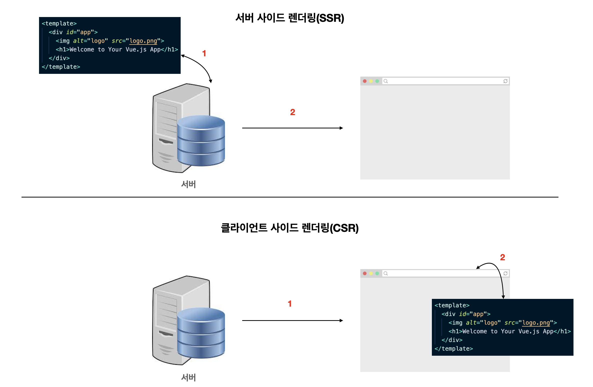

# 서버 사이드 렌더링이란?

서버 사이드 렌더링이란 서버에서 페이지를 그려 클라이언트(브라우저)로 보낸 후 화면에 표시하는 기법을 의미합니다. 뷰 싱글 페이지 애플리케이션을 서버 사이드 렌더링의 반대인 클라이언트 사이드 렌더링 방식입니다. 이 글에서는 클라이언트 사이트 렌더링과 서버 사이드 렌더링 방식의 차이점을 살펴보고 서버 사이드 렌더링의 장단점을 분석해 보겠습니다.

## 클라이언트 사이드 렌더링

클라이언트 사이드 렌더링을 이해하기 위해서 뷰 CLI로 생성된 프로젝트의 실행 결과를 살펴보겠습니다. 아래는 뷰 
CLI로 생성한 프로젝트의 기본 코드입니다.

```js
// src/main.js
import Vue from "vue";
import App from "./App.vue";

new Vue({
  render: (h) => h(App),
}).$mount("#app");
```

위 코드는 뷰의 인스턴스를 생성하는 코드입니다. 이 인스턴스는 아래 `index.html` 파일의 `app` 아이디를 갖는 태그에 부착됩니다.

```html{11}
<!-- public/index.html -->
<!DOCTYPE html>
<html lang="">
  <head>
    <!-- ... -->
  </head>
  <body>
    <noscript>
      <strong>We're sorry but <%= htmlWebpackPlugin.options.title %> doesn't work properly without JavaScript enabled. Please enable it to continue.</strong>
    </noscript>
    <div id="app"></div>
    <!-- built files will be auto injected -->
  </body>
</html>
```

CLI로 프로젝트를 생성하고 난 후 `npm run serve`로 프로젝트를 실행하고 브라우저를 확인하면 뷰 기본 페이지가 뜹니다. 이 때 개발자 패널의 `Network` 탭에서 `Doc`으로 필터링한 결과는 아래와 같습니다.


서버에서 넘겨받은 HTML 코드에는 `body` 태그 본문에 `<div id="app"></div>` 밖에 없지만 화면에는 
`Welcome To Your Vue.js App` 텍스트와 이미지가 있습니다. 이 텍스트와 이미지는 모두 클라이언트(브라우저)에서 동작한 `Vue.js` 라이브러리가 그려준 것입니다. 즉 브라우저에서 화면의 결과를 그려낸 것이죠.

## 서버 사이드 렌더링과 클라이언트 사이드 렌더링 차이점

그럼 서버 사이드의 렌더링은 앞에서 살펴본 클라이언트 사이드 렌더링과 무슨 차이점이 있을까요? 바로 어디서 화면에 보일 페이지의 내용을 그리느냐의 차이입니다. 클라이언트 사이드 렌더링은 페이지의 내용을 브라우저에서 그리고 서버 사이드 렌더링은 서버에서 페이지의 내용을 다 그려서 브라우저로 던져줍니다. 아래와 같이 말이죠.



<!-- ## 서버 사이드 렌더링과 클라이언트 사이드 렌더링의 렌더링 절차 비교

SPA의 초기 화면 렌더링을 위해 브라우저가 진행해야 하는 일들

`/about` 이라는 페이지로 이동한다고 가정했을 때의 절차

- index.html 파일 다운로드
- Vue.js 애플리케이션 관련된 JS 라이브러리 모두 다운로드
- Vue.js 애플리케이션 초기화
- Vue Router 초기화 및 해당 페이지로 이동
- 화면에 표시하기 위한 REST API 데이터 요청 및 화면 구성
- Vue.js 템플릿의 내용을 사용자가 볼 수 있게 렌더링

SSR의 초기 화면 렌더링 절차

- ..

`hydration`이라는 작업을 거친 이후에는 SPA 처럼 동작하는 것이 Universal Mode의 특징

할 일 : [ ] 바탕화면 nuxt-img 폴더의 이미지 보고 위 섹션의 ssr 내용 정리 필요 -->

## 서버 사이드 렌더링을 왜 쓸까?

서버 사이드 렌더링을 쓰는 목적은 크게 "검색 엔진 최적화"와 "빠른 페이지 렌더링"입니다. 검색 엔진 최적화란 구글, 네이버와 같은 검색 사이트에서 검색했을 때 결과가 사용자에게 많이 노출될 수 있도록 최적화 하는 기법입니다. 특히, SNS에서 링크를 공유했을 때 해당 웹 사이트의 정보를 이미지와 설명으로 표시해주는 OG(Open Graph) Tag를 페이지 별로 적용하기 위해서는 서버 사이드 렌더링이 효율적입니다.


또한, 서버 사이드 렌더링은 빈 HTML 페이지를 받아 브라우저에서 그리는 클라이언트 사이드 렌더링과 다르게 서버에서 미리 그려서 브라우저로 보내주기 때문에 페이지를 그리는 시간을 단축할 수 있습니다. 사용자 입장에서는 화면에 유의미한 정보가 표시되는 시간이 빨라지는 것이죠.

## 서버 사이드 렌더링의 단점

이렇게만 보면 서버 사이드 렌더링을 하는게 좋겠네 라고 생각하실 수 있지만 시작하기 전에 주의해야 할 점이 있습니다. 서버 사이드 렌더링은 Node.js 웹 애플리케이션 실행 방법을 알아야하고 서버쪽 환경 구성과 함께 클라이언트, 서버 빌드에 대한 이해가 필요합니다. 따라서, 프런트엔드 개발 입문자 입장에서는 쉽지 않은 진입 장벽이 존재합니다.

또한, Node.js 환경에서 실행되기 때문에 브라우저 관련 API를 다룰 때 주의해야 합니다. 뷰 싱글 페이지 애플리케이션의 라이프 사이클 훅과는 다른 환경(브라우저가 아닌 Node.js)에서 동작하기 때문에 `beforeCreate`와 `created`에서 `window`나 `document`와 같은 브라우저 객체에 접근할 수 없습니다.


:::tip
서버 사이드 렌더링의 경우 컴포넌트가 최초로 생성되는 시점이 브라우저 위가 아니라 Node.js 환경이기 때문에 `beforeCreate`나 `created`에서 브라우저 객체를 접근할 수 없습니다. 대신 `beforeMount`나 `mounted`에서 `window`와 `document`를 접근할 수 있습니다 :)
:::

## 참고 자료

- [Nuxt Server Side Rendering](https://nuxtjs.org/docs/2.x/concepts/server-side-rendering)
- [Vue SSR Guide](https://ssr.vuejs.org/#what-is-server-side-rendering-ssr)
- [Nuxt.js 시작하기 - 인프런](https://www.inflearn.com/course/넉스트-시작하기?inst=cc965820)