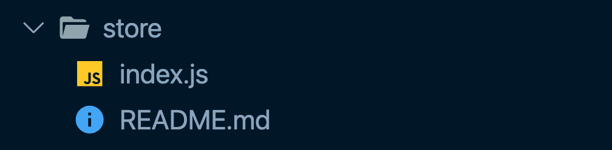

# Vuex in Nuxt

넉스트에서 뷰엑스(Vuex)를 사용하려면 아래와 같이 프로젝트 폴더의 루트 레벨에 `store` 폴더를 생성하고 그 밑에 `js` 파일을 생성합니다.



이렇게 하면 `Vuex` 라이브러리가 임포트 되면서 뷰엑스를 사용할 수 있습니다.

:::tip
만약 프로젝트 폴더에 `store` 폴더가 없다면 뷰엑스 라이브러리는 자동으로 비활성화 됩니다. 여기서 비활성화란 빌드 파일에 포함되지 않는 것을 의미합니다.
:::

## 뷰엑스 시작하기

뷰엑스는 Vue.js의 상태 관리 라이브러리이자 패턴을 의미합니다. 뷰엑스가 무엇인지 모른다면 아래에 안내된 링크로 먼저 학습하고 이후 내용을 학습하세요. [Vuex 소개 글](../vuex/concept.html)

넉스트에서 뷰엑스를 시작하기 위해서는 `store/index.js` 파일을 생성하고 아래와 같은 내용을 입력해야 합니다.

```js
// store/index.js
export const state = () => ({
  user: {}
})

export const mutations = {
  setUser(state, user) {
    state.user = user;
  }
}

export const actions = {
  async fetchUser(context) {
    const response = await axios.get('users/1');
    context.commit('setUser', response.data);
  }
}
```

기존 싱글 페이지 애플리케이션과는 다르게 다음과 같은 설정 코드가 필요하지 않습니다.

```js
// Vue CLI로 생성한 프로젝트에서 Vuex를 사용하는 경우
import Vue from 'vue';
import Vuex from 'vuex';

Vue.use(Vuex);

new Vuex.Store({
  // ...
})
```

이렇게 설정한 뷰엑스 코드는 컴포넌트 내에서 기존과 같은 방식으로 동일하게 접근할 수 있습니다.

```html
<template>
  <div>
    <p>{{ $store.state.user }}</p>
    <button @click="displayUser"></button>
  </div>
</template>

<script>
export default {
  methods: {
    displayUser() {
      const user = { name: '넉스트' };
      this.$store.commit('setUser', user);
    }
  }
}
</script>
```

## 뷰엑스의 모듈화

`store` 폴더 밑에 생성한 `index.js`는 뷰엑스의 모듈화 관점에서는 루트 모듈이 됩니다. 만약 `products.js`와 같이 다른 자바스크립트 파일을 생성하고 아래와 같은 내용을 입력하면 스토어의 `products` 모듈이 됩니다.

```js
// store/products.js
export const state = () => ({
  items: []
})

export const mutations = {
  addItems(state, item) {
    state.items.push(item);
  }
}
```

위 코드는 마치 싱글 페이지 애플리케이션의 아래 코드와 같이 동작합니다.

```js{9-19}
// Vue CLI로 생성한 프로젝트에서 Vuex를 사용하는 경우
import Vue from 'vue';
import Vuex from 'vuex';

Vue.use(Vuex);

new Vuex.Store({
  modules: {
    products: {
      namespaced: true,
      state: () => ({
        items: []
      }),
      mutations: {
        addItems(state, item) {
          state.items.push(item);
        }
      }
    }
  }  
})
```

## nuxtServerInit

`nuxtServerInit` 속성은 넉스트의 `universal` 모드에서 사용할 수 있는 액션 속성입니다.

```js
// store/index.js
actions: {
  nuxtServerInit(context, { req }) {
    if (req.session.user) {
      context.commit('user', req.session.user)
    }
  }
}
```

위 속성은 서버 사이드 렌더링 시점에 실행되기 때문에 스토어에 미리 데이터를 설정해 놓거나 서버에서만 접근할 수 있는 데이터를 다룰 때 유용합니다. 만약, 서버에서 세션을 관리하는 구조이고 세션에 연결된 사용자 정보를 스토어에 저장해야 할 때 위와 같은 방식으로 사용자 정보를 스토어에 미리 담아놓을 수 있습니다.

`nuxtServerInit` 액션 속성의 파라미터는 액션 속성이기 때문에 주어지는 스토어의 컨텍스트를 접근할 수 있는 첫 번째 파라미터 말고도 [넉스트의 컨텍스트](https://ko.nuxtjs.org/docs/2.x/concepts/context-helpers/)를 접근할 수 있는 두 번째 파라미터가 주어집니다.

```js{3,4,6}
// store/index.js
actions: {
  nuxtServerInit(storeContext, nuxtContext) {
    storeContext.commit('뮤테이션 함수명');
    if (process.server) {
      const { req, res, beforeNuxtRender } = nuxtContext;
    }
  }
}
```

위 `nuxtContext` 파라미터는 `asyncData` 메서드의 [파라미터](https://ko.nuxtjs.org/docs/2.x/features/data-fetching/#async-data)와 같습니다.