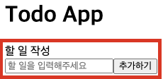

# Tutorial - Todo App

이번 튜토리얼에서는 간단한 Todo App을 만들면서 각 컴포넌트의 유닛 테스트(Unit Test)를 작성해보겠습니다. 컴포넌트를 구현하고 해당 컴포넌트의 테스트 코드를 작성하는 순서로 작업합니다. 이 튜토리얼은 학습하시는 분들을 위해 단계별로 코드를 제공합니다. 최대한 먼저 따라 해보시고 안되는 부분만 참고하는 용도로 사용해 주세요.

## 프로젝트 셋업
[완성 코드](https://github.com/dngwoodo/vue-todo-app-test/tree/6f2a8fb79aa7bf85db495864ac7f40b2c26ed13f)

1. vue cli 최신 버전 설치   
```bash
npm install -g @vue/cli
```
<br />

2. 프로젝트 생성
```bash
vue create todo-app-test
```
프로젝트 생성 시 매뉴얼 선택은 [링크](https://joshua1988.github.io/vue-camp/testing/vue-test-util.html#%E1%84%85%E1%85%A1%E1%84%8B%E1%85%B5%E1%84%87%E1%85%B3%E1%84%85%E1%85%A5%E1%84%85%E1%85%B5-%E1%84%89%E1%85%A5%E1%86%AF%E1%84%8E%E1%85%B5)를 참고해 주세요.   
<br />

3. eslint의 `env` 옵션 속성에 `jest: true` 추가   
```js
module.exports = {
  root: true,
  env: {
    node: true,
    jest: true, // jest api들을 사용할 때 에러 표시가 나지 않게 해줍니다.
  },
  //...
}
```
<br />

4. `@types/jest` 라이브러리 설치

`@types/jest` 라이브러리는 jest api들의 자동완성을 제공합니다.
```bash
npm install @types/jest -D
```
<br />

5. jest.config.js에 `testMatch` 설정 추가   
    
  테스트해야 하는 컴포넌트와 테스트 코드가 한 폴더 내에 존재하면 찾을 때 편리합니다. 그러므로 [@vue/cli-plugin-unit-jest](https://github.com/vuejs/vue-cli/blob/dev/packages/%40vue/cli-plugin-unit-jest/presets/default/jest-preset.js)의 testMatch 설정값을 추가합니다. 기본적인 jest 설정들의 역할들은 [여기](https://joshua1988.github.io/vue-camp/testing/vue-test-util.html#%E1%84%91%E1%85%A2%E1%84%8F%E1%85%B5%E1%84%8C%E1%85%B5-json-%E1%84%89%E1%85%A5%E1%86%AF%E1%84%8C%E1%85%A5%E1%86%BC)를 참고하세요.
  
  ```js
  module.exports = {
    preset: "@vue/cli-plugin-unit-jest",
    testMatch: ["**/src/**/*.(test|spec).js"], // src 폴더 내의 파일 이름에 spec이나 test가 포함돼 있다면 테스트를 수행합니다.
  };
  ```
<br />

6. 테스트 코드 실행해보기   
   
App 컴포넌트를 제외한 모든 컴포넌트를 삭제해 주세요. 그리고 아래와 같이 코드를 작성해 줍니다.
```html
<!-- src/App.vue -->
<template>
  <div>
    <h1>Todo App</h1>
  </div>
</template>
```
```js
// src/App.test.js
import { shallowMount } from "@vue/test-utils";

import App from "./App.vue";

describe("App", () => {
  it("renders title", () => {
    const wrapper = shallowMount(App);

    expect(wrapper.find("h1").text()).toMatch("Todo App");
  });
});
```
이제 테스트 코드를 실행해 주면 됩니다.
```bash
npm run test:unit
```

터미널 창에 아래와 같이 출력 된다면 프로젝트 셋업이 정상적으로 완료된 것입니다.
```bash
> vue-cli-service test:unit

PASS  src/App.test.js
  App
    ✓ renders title (21ms)

Test Suites: 1 passed, 1 total
Tests:       1 passed, 1 total
Snapshots:   0 total
Time:        1.403s
Ran all test suites.
```

:::tip

```json
// package.json
{
  //...
  "scripts": {
    // ...
    "test:unit": "vue-cli-service test:unit --watchAll"
  }
}
```
package.json에 `test:unit` 스크립트에  `--watchAll` 옵션을 추가해주세요. 테스트가 추가되거나 수정되면 자동으로 다시 실행시켜줍니다.
:::

## 프로젝트 시작

프로젝트 준비가 끝났으니 Todo App을 구현해보겠습니다. 우리가 구현해야 되는 기능들은 다음과 같으며 차례대로 구현합니다.
- 할 일 추가하기
- 할 일 체크하기
- 할 일 삭제하기

## 할 일 추가하기

[완성 코드]()

1. UI 구현   

아래에 빨간 박스로 표시된 부분의 UI를 구현합니다.


```html
<!-- src/App.vue -->
<template>
  <div>
    <h1>Todo App</h1>
    <form>
      <label for="todo-control">할 일 작성</label>
      <div>
        <input
          id="todo-control"
          type="text"
          placeholder="할 일을 작성해주세요"
        />
        <button type="button">추가하기</button>
      </div>
    </form>
  </div>
</template>
```
<br />

2. UI 구현 - 테스트 코드 작성   

UI 구현 코드에서 작성해야 되는 테스트 코드는 다음과 같습니다.
- `할 일 작성`이라는 텍스트가 화면에 출력됩니다.
- 할 일을 작성할 수 있는 `control`창이 화면에 출력됩니다.
- `추가하기`라는 버튼이 화면에 출력됩니다.

한가지 알아두셔야 할 것은 테스트 코드는 작성하는 사람에 따라 얼마든지 달라질 수 있습니다. 테스트 코드를 얼마나 세세하게 작성하냐에 따라서 코드의 안전성이 달라집니다. 즉, 테스트 코드를 작성한다고 해서 모든 에러를 방지할 수 있는 게 아닙니다. 그러므로 학습하실 때는 조금이라도 더 세세하게 테스트를 작성해보시는 걸 권장해 드립니다.

이제 관련 있는 테스트끼리 묶어서 코드를 작성해보겠습니다.

```js
// src/App.test.vue
import { shallowMount } from "@vue/test-utils";

import App from "./App.vue";

describe("App", () => {
  it("renders title", () => {
    const wrapper = shallowMount(App);

    expect(wrapper.find("h1").text()).toMatch("Todo App");
  });

  it("renders label, input", () => {
    const wrapper = shallowMount(App);

    // '할 일 작성'이라는 텍스트가 화면에 출력됩니다.
    expect(wrapper.find("label").text()).toMatch("할 일 작성");

    // 할 일을 작성할 수 있는 'control'창 이 화면에 출력됩니다.
    expect(wrapper.find("input").attributes("placeholder")).toMatch(
      "할 일을 작성해주세요"
    );
  });

  it("renders button", () => {
    const wrapper = shallowMount(App);

    // '추가하기'라는 버튼이 화면에 출력됩니다.
    expect(wrapper.find("button").text()).toMatch("추가하기");
  });
});
```

막상 테스트 코드를 작성을 하고 보니 한가지 아쉬운 게 있습니다. `control`창과 `label`이 연결된 지도 확인해보고 싶습니다. 테스트를 하나 더 추가해보겠습니다.

```js
it("connects label and input", () => {
  const wrapper = shallowMount(App);
  const TODO_CONTROL = 'todo-control'

  expect(wrapper.find("label").attributes("for")).toMatch(TODO_CONTROL);
  expect(wrapper.find("input").attributes("id")).toMatch(TODO_CONTROL);
});
```

이런 식으로 학습하시면서 아쉬운 부분들이 생긴다면 테스트를 추가해보세요.

그리고 위의 테스트 코드에서 `describe`, `it`의 첫 번째 인수를 합쳐보면 `App renders label, input`, `App renders button`으로 문장이 만들어지는 것을 보실 수 있습니다. `render`는 `App`이 단수이기 때문에 뒤에 s를 붙여서 `renders`로 작성하는 겁니다. 이런 식으로 문법에 맞게 작성해주세요. 그리고 테스트 코드를 작성하실 때는 항상 `말이 되게` 작성하시는 것을 권장해 드립니다. 나중에 해당 컴포넌트의 역할을 파악하고 싶을 때 [관심사의 분리(separation of concerns, SoC)](https://ko.wikipedia.org/wiki/%EA%B4%80%EC%8B%AC%EC%82%AC_%EB%B6%84%EB%A6%AC)를 잘해놓았다면 테스트 코드만으로도 파악이 가능합니다. 이 부분은 튜토리얼 마지막 부분에서 다뤄보겠습니다.   
<br />

1. 기능 구현 - `control`창에 할 일 작성 시 data에 할 일 텍스트 값 넣기
```html
<!-- src/App.vue -->
<template>
  <div>
    <h1>Todo App</h1>
    <form>
      <label for="todo-control">할 일 작성</label>
      <div>
        <input
          id="todo-control"
          type="text"
          placeholder="할 일을 작성해주세요"
          :value="text"
          @input="handleInput"
        />
        <button type="button">추가하기</button>
      </div>
    </form>
  </div>
</template>

<script>
export default {
  data() {
    return {
      text: "",
    };
  },
  methods: {
    handleInput(event) {
      this.text = event.target.value;
    },
  },
};
</script>
```

v-model을 사용하지 않은 이유는 현재 시점에서는 IME 입력(한국어, 일본어, 중국어)에 대해서 한계점이 있기 때문입니다. 자세한 내용은 이 [링크](https://joshua1988.github.io/web-development/vuejs/v-model-usage/#%EA%B7%B8%EB%9F%BC-v-model%EC%9D%B4-%EB%8D%94-%ED%8E%B8%ED%95%98%EB%8B%88%EA%B9%8C-%EC%9D%B4%EA%B1%B0-%EC%93%B0%EB%A9%B4-%EB%90%98%EB%8A%94%EA%B1%B0%EC%A3%A0)를 참고해주세요.   
<br />

4. 기능 구현 - 테스트 코드 작성
```js
// src/App.test.js
  it("listens input event", () => {
    const wrapper = shallowMount(App);

    // setValue는 아래 두 코드의 축약 api 입니다.
    wrapper.find("input").setValue("아무것도 안하기");
    // wrapper.find("input").element.value = "아무것도 안하기";
    // wrapper.find("input").trigger("input");

    expect(wrapper.vm.text).toMatch("아무것도 안하기");
  });
```

vue-test-utils 라이브러리에선 `input`이벤트를 `trigger`시 `event.target.value`를 직접적으로 변경할 수 없습니다. 그래서 `input`의 `value`값을 변경한 뒤 `input`이벤트를 `trigger`해야 합니다. `input`이벤트를 `trigger`하면 `handleInput`함수가 실행되고 `data`의 `text`값이 변경됐는지 테스트합니다.
<br />

5. 기능 구현 - `추가하기` 버튼을 누르면 할 일 추가
```html
<!-- src/App.vue -->
<template>
  <div>
    <h1>Todo App</h1>
    <form>
      <label for="todo-control">할 일 작성</label>
      <div>
        <input
          id="todo-control"
          type="text"
          placeholder="할 일을 작성해주세요"
          :value="text"
          @input="handleInput"
        />
        <!-- @click="handleClick" 추가 -->
        <button type="button" @click="handleClick">추가하기</button>
      </div>
    </form>
    <!-- ul, li 태그 추가 -->
    <ul>
      <li v-for="todo in todos" :key="todo.id">
        {{ todo.text }}
      </li>
    </ul>
  </div>
</template>

<script>
export default {
  data() {
    return {
      text: "",
      newId: 0, // 추가
      todos: [], // 추가
    };
  },
  methods: {
    handleInput(event) {
      this.text = event.target.value;
    },
    // 추가
    handleClick() {
      // 할 일 추가
      this.todos.push({
        id: this.newId,
        text: this.text,
      });
      this.newId += 1;

      // control값 초기화
      this.text = "";
    },
  },
};
</script>
```
<br />

6. 기능 구현 - 테스트 코드 작성
```js
// src/App.test.js
it("listens click event", async () => {
  const wrapper = shallowMount(App);

  wrapper.find("input").setValue("아무것도 안하기");

  await wrapper.find("button").trigger("click");

  expect(wrapper.find("li").text()).toContain("아무것도 안하기");
});
```

`click`이벤트 트리거는 비동기로 동작하기 때문에 `async, await`문법을 사용하여 동기적으로로 동작하게 만듭니다. `control`창에 할 일을 타이핑하고 `추가하기` 버튼이 클릭 됐을 때 타이핑한 할 일이 화면에 출력 되는지 테스트합니다.
