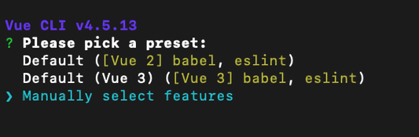

# Vue Test Utils

뷰 테스트 유틸([Vue Test Utils](https://vue-test-utils.vuejs.org/))은 코어 팀 멤버가 제작한 테스팅 보조 라이브러리입니다. 제스트(Jest) 뿐만 아니라 다른 테스트 도구도 사용할 수 있습니다.

## 최신 Vue-CLI (3.x 버전 이상)에서 설치 방법

새로운 프로젝트의 경우 기본 환경이 설정된 `기본 프리셋(Default)`을 사용할 수 있지만, 뷰 테스트 유틸을 설치하기 위해 아래와 같이 **Manually select features** 옵션을 선택해줍니다.



뷰 테스트 유틸을 설치하기 위해 **Unit Testing** 옵션을 선택해줍니다.


:::tip
방향키(↑, ↓)로 항목을 이동할 수 있고 `space` 키로 선택/해제, `enter` 키로 결정할 수 있습니다.
:::

### Vue CLI 옵션 선택

**Unit Testing** 옵션을 추가하고 나면 아래와 같이 차례대로 선택합니다.

1. 먼저 코드 정리 도구인 Prettier와 문법 검사 도구인 ESLint를 선택합니다.


2. 다음은 문법 검사 도구의 실행 시점을 선택합니다. 에디터에서 저장을 누를 때마다 검사하는 것으로 선택합니다.


3. 단위 테스트 도구는 제스트로 선택합니다.


4. 위에서 추가한 ESLint와 프리티어의 설정 내용을 package.json에 추가하지 않고 개별 설정 파일에 관리합니다.


## 기존 Vue-CLI (2.x 버전 이하)에서 설치 방법

아래의 명령어로 뷰 테스트 유틸 라이브러리를 설치합니다.

```bash
npm install jest @vue/test-utils vue-jest babel-jest --save-dev
```

위 명령어로 `vue test util`, `jest`, `vue-jest`, `babel-jest` 4개의 라이브러리가 설치됩니다.

### babel 사용하기

프로젝트에 [바벨(babel)](https://babeljs.io/docs/en/)을 설정한 적이 없다면 아래와 같이 설치해줍니다.

```bash
npm install @babel/core @babel/preset-env babel-core@^7.0.0-bridge.0 --save-dev
```

바벨은 자바스크립트(JavaScript) 컴파일러로서 작성한 최신 코드(ECMAScript 2015 버전 이상)를 이전 버전(오래된 브라우저 또는 환경)에 호환하여 동작할 수 있도록 코드를 변환해주는 도구입니다.

```javascript
// 바벨 입력: ES2015 화살표 함수
[1, 2, 3].map(n => n + 1);

// 바벨 출력: 변환된 코드
[1, 2, 3].map(function(n) {
  return n + 1;
});
```

바벨 프리셋을 `package.json` 또는 `babel.config.json` 또는 `babel.config.js`에서 설정할 수 있습니다.

```json
// package.json
{
  // ...
  "babel": {
    "presets": ["@babel/preset-env"]
  }
}
```

```json
// babel.config.json
{
  "presets": ["@babel/preset-env"]
}
```

```javascript
// babel.config.js
module.exports = {
  presets: ["@babel/preset-env"] // 수동 설정
  presets: ["@vue/cli-plugin-babel/preset"] // vue cli로 설치한 경우 자동 설정됨
};
```

제스트와 관련된 환경 설정은 **`제스트 환경 설정`** 에서 확인해보세요.

* **transform**의 **babel-jest**

### 제스트 환경 설정

**`package.json`** 에서 설정 하거나  **`jest.config.js`** 에서 설정 할 수 있습니다.

#### package.json 설정

설치하고 나서 `package.json` 파일에 아래의 옵션을 추가합니다.

```json
{
  // ...
  "jest": {
    // vue-cli 테스트 환경 설정을 사용합니다
    // 주의! preset 지정 후 아래와 같이 각각 다시 설정하는 경우, 새로 설정한 내용으로 적용됩니다
    "preset": "@vue/cli-plugin-unit-jest",
    "moduleFileExtensions": [
      "js",
      "json",
      // 모든 vue 파일(`*.vue`)을 처리하기 위해 Jest에게 알려줍니다
      "vue"
    ],
    "transform": {
      // `vue-jest`를 사용하여 모든 vue 파일(`*.vue`)을 처리합니다
      ".*\\.(vue)$": "vue-jest",
      // `babel-jest`를 사용하여 모든 js 파일(`*.js`)을 처리합니다
      ".*\\.(js)$": "babel-jest",
    },
    "moduleNameMapper": {
      // '프로젝트 경로/src' 까지 경로를 '@' 별칭으로 맵핑합니다
      // ex) import HelloWorld from "@/components/HelloWorld.vue";
      //     모듈 경로는 "프로젝트 경로/src/components/HelloWorld.vue"와 같습니다
      "^@/(.*)$": "<rootDir>/src/$1"
    },
    "testMatch": [
      // __tests__ 경로 하위에 있는 모든 js/ts/jsx/tsx 파일을 테스트 대상으로 지정합니다
      "**/__tests__/**/*.[jt]s?(x)",
      // 파일 이름에 'xxx.spec' 또는 'xxx.test'라는 이름이 붙여인 모든 js/ts/jsx/tsx 파일을 테스트 대상으로 지정합니다
      "**/?(*.)+(spec|test).[jt]s?(x)"
    ],
    // node_modules 경로 하위에 있는 모든 테스트 파일을 대상에서 제외합니다
    "testPathIgnorePatterns": ["/node_modules/"],
    "collectCoverage": true,
    "collectCoverageFrom": [
      "**/*.{js,vue}",
      "!**/node_modules/**"
    ]
  }
}
```

::: danger
JSON 파일이므로 복사해 붙여넣을 때 주석은 제거해주세요.
:::

#### jest.config.js 설정

Vue-CLI를 이용하여 `Unit Testing`을 선택했다면 `jest.config.js` 파일을 자동으로 생성합니다.

npm으로 직접 설치했다면 프로젝트 경로(최상위)에 `jest.config.js` 파일을 생성해줍니다.

```javascript
module.exports = {
  // (vue-cli로 설치 시 기본 세팅됨) vue-cli 테스트 환경 설정을 사용합니다
  // 주의! preset 지정 후 아래와 같이 각각 다시 설정하는 경우, 새로 설정한 내용으로 적용됩니다
  preset: "@vue/cli-plugin-unit-jest",
  moduleFileExtensions: [
    'js',
    'json',
    // 모든 vue 파일(`*.vue`)을 처리하기 위해 Jest에게 알려줍니다
    'vue',
  ],
  transform: {
    // `vue-jest`를 사용하여 모든 vue 파일(`*.vue`)을 처리합니다
    '.*\\.(vue)$': 'vue-jest',
    // `babel-jest`를 사용하여 모든 js 파일(`*.js`)을 처리합니다
    '.*\\.(js)$': 'babel-jest',
  },
  moduleNameMapper: {
    // '프로젝트 경로/src' 까지 경로를 '@' 별칭으로 맵핑합니다
    // ex) import HelloWorld from "@/components/HelloWorld.vue";
    //     모듈 경로는 "프로젝트 경로/src/components/HelloWorld.vue"와 같습니다
    '^@/(.*)$': '<rootDir>/src/$1'
  },
  testMatch: [
    // __tests__ 경로 하위에 있는 모든 js/ts/jsx/tsx 파일을 테스트 대상으로 지정합니다
    '**/__tests__/**/*.[jt]s?(x)',
    // 'xxx.spec' 또는 'xxx.test'라는 이름의 모든 js/ts/jsx/tsx 파일을 테스트 대상으로 지정합니다
    '**/?(*.)+(spec|test).[jt]s?(x)'
  ],
  // node_modules 경로 하위에 있는 모든 테스트 파일을 대상에서 제외합니다
  testPathIgnorePatterns: ['/node_modules/'],
  collectCoverage: true,
  collectCoverageFrom: [
    '**/*.{js,vue}',
    '!**/node_modules/**'
  ],
};
```

::: tip
`jest.config.js` 파일로 분리하면 환경 설정 부분만 모아놓을 수 있어서 유지보수가 쉬워집니다.

자바스크립트 파일이므로 주석 작성도 가능합니다.
:::

::: details 각 설정에 대한 상세 설명
**preset**

* 이미 테스트에 필요한 기본 설정을 갖춘 외부 환경 설정을 사용합니다.
* `@vue/cli-plugin-unit-jest`의 경우 vue-cli 환경에 맞춰 기본적으로 세팅된 테스트 환경 설정을 사용합니다.
* 기본적으로 세팅하는 내용은 [vue-cli github](https://github.com/vuejs/vue-cli/tree/dev/packages/%40vue/cli-plugin-unit-jest)에서 확인해보세요.

**moduleFileExtensions**

* 모듈에서 사용할 파일 확장명

**transform**

* 변환기(transformer, 우측)를 사용하여 지정한 대상(좌측)을 변환합니다.

**moduleNameMapper**

* 모듈 이름(우측)을 특정 이름(좌측)으로 맵핑하여 치환합니다.
* `'^@/(.*)$': '<rootDir>/src/$1'`에서 `$1`은 좌측 정규 표현식(Regular Expression) 중 `(.*)`와 치환되어, `<rootDir>/src/` 하위의 모든 파일을 가리킵니다.

**testMatch**

* 테스트 실행 시, 대상으로 포함시킬 파일을 지정합니다.

**testPathIgnorePatterns**

* `testMatch`에서 지정한 대상 중 의도적으로 테스트 대상에서 제외할 경로 또는 특정 패턴을 가진 대상을 지정합니다.
* `node_modules` 하위에는 라이브러리 모듈이 설치되어 있으니 일반적으로 대상에서 제외합니다.

**collectCoverage**

* 커버리지(coverage) 정보의 수집 여부
* 테스트한 케이스가 얼마나 충족되었는지를 나타내는 지표 보고서를 생성합니다.
  * `true`일 경우, 테스트 실행할 때마다 자동으로 생성
  * `false`일 경우, 제스트를 명령어로 실행할 때 `--coverage`를 포함해주면 생성
* 결과는 `터미널` 또는 `프로젝트/lcov-report/index.html`을 열어보면 확인할 수 있습니다.

**collectCoverageFrom**

* 커버리지를 수집할 대상을 지정
* 위 설정의 경우, **모든 js 파일과 vue 파일**에 대하여 **수집**하며 **node_modules에 존재하는 파일**을 대상에서 **제외**합니다.

자세한 내용은 [Jest 공식 문서의 Configuring Jest](https://jestjs.io/docs/configuration)에서 확인해보세요.
:::

이제 다음 챕터에서 간단한 테스트 코드를 작성해보겠습니다.
