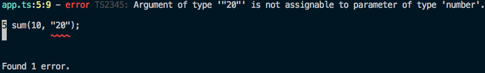

# 왜 타입스크립트를 사용하는가?

타입이 없는 자바스크립트는 애플리케이션이 실행되었을 때만 에러를 검출할 수 있습니다. 따라서, 실행 시점에만 발생하는 잠재적인 오류에 대해서는 특별한 조치를 취하기가 어렵습니다. 이러한 문제점을 해결하고자 대두되는 기술이 타입스크립트입니다.

## TypeScript 맛보기

뷰에 타입스크립트를 연동해보기 전에 간단하게 타입스크립트의 코드를 살펴보겠습니다. 먼저 아래와 같이 타입스크립트를 전역으로 설치합니다.

```bash
npm i typescript -g
```

이제 명령어 입력 창에서 `tsc` 라는 명령어를 실행할 수 있습니다. 이 명령어를 사용하면 타입스크립트로 작성된 코드를 브라우저에서 실행할 수 있는 자바스크립트 코드로 변환할 수 있게 되죠.

이제 타입스크립트 코드를 보겠습니다.

```ts
// app.ts
function sum(a: number, b: number) {
  return a + b;
}
```

두 숫자의 합을 구하는 sum 함수에 타입스크립트를 적용한 코드입니다. 함수의 인자는 숫자(number)만 받을 수 있게 됩니다. 위의 코드를 아래와 같이 변환할 수 있습니다.

```bash
tsc app.ts
```

실행 결과로 같은 이름의 js 파일인 `app.js`를 생성합니다.

## TypeScript의 장점

앞에서 살펴본 타입스크립트 코드의 장점은 위 코드를 브라우저에서 실행하기 전에 에러를 검출할 수 있다는 것입니다. 만약 코드가 아래와 같았다면 자바스크립트 코드로 변환할 때 어떤 일이 발생하였을까요?

```ts
// app.ts
function sum(a: number, b: number) {
  return a + b;
}

sum(10, [20]);
```

위 코드를 `tsc`로 변환하면 아래와 같은 에러가 발생됩니다.



만약 타입스크립트를 쓰지 않고 그냥 브라우저에서 실행했다면 두 숫자의 합이 아니라 숫자와 배열을 더했을 겁니다. 따라서, 숫자의 합을 구하려고 만든 함수의 본질이 흐려지게 되죠.

실행 시점에서 유연하게 타입을 바꾸는 자바스크립트의 특징이 때로는 이와 같이 예기치 못한 동작과 에러를 발생시킬 수 있습니다. 하지만, 타입스크립트를 사용함으로써 이런 에러들을 미리 잡아낼 수 있죠.

이처럼 **브라우저에서 실행하고 잘못된 결과를 확인하기 전에 미리 컴파일(코드 변환) 시점에 타입 변환으로 인한 에러를 검출할 수 있는 것**이 타입스크립트의 장점입니다.