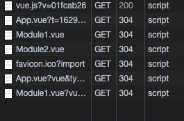

# Vite란?

## 등장 배경

ES modules이 등장하면서 개발자들은 모듈화된 방식으로 개발을 진행하게 되었습니다. 그리고 이런 모듈을 묶어주는 번들링을 필요하게 되었으며, 우리는 webpack, Rollup, Parcel을 사용해서 번들링을 하게 되었습니다.

그러나 자바스크립트 어플리케이션의 크기가 점차 증가하게 되면서 문제가 시작됩니다. 초기 개발 서버가 시작될 때 한번 번들링 작업을 기다리는 것과 개발 중에는 HMR(Hot Module Replacement)의 속도가 저하 되는 문제를 겪기 때문이죠. 그리고 이 단점을 개선하기 위해 Vite가 등장하게 되었습니다.

## vite 이해하기

- Vite는 프랑스어로 '빠른'이라는 뜻으로 말 그대로 빠른 개발 환경을 제공하는 빌드 도구입니다.

- Vite는 개발자가 최신 브라우저를 사용할 것으로 가정하기 때문에 브라우저에서 바로 최신 JS 기능을 사용합니다, 즉 babel 변환이 없습니다.

- Vite는 네이티브 ES Import를 사용합니다. 이 뜻은 Vite를 처음 실행하면 브라우저에게 `index.html`을 제공합니다. 브라우저는 제공된 `index.html`의 `<script type="module" src="...">`을 참조하여 import 된 파일을 http 요청으로 받아옵니다. 만약 개발 환경에서 소스 수정시 수정된 파일만 다시 http 요청으로 불러옵니다. <br /><br /> 아래를 예시로 들면 `Module1.vue`와 `Module2.vue` 파일을 만들고 이 파일을 `App.vue`에서 import 하면 vite에서는 Module1과 Module2를 http통신을 통해 받아옵니다. 또한 만약 `Module1.vue` 파일이 변경 되었다면 `Module1.vue`만 다시 http 통신하여 받아옵니다.<br /> 각 module를 http 통신하기 때문에 module 수가 아무리 많아도 Hot module replacement(HMR) 속도는 변함이 없습니다.

<div style="margin-left: 20px">
  
</div>

- 한번 http 통신을 통해 받아온 모듈은 `max-age=31536000`으로 캐싱되어 다시 통신하지 않습니다.

- Vite는 개발 환경에서는 위에서 설명한 Native ES Module을 사용하고, 빌드시 [Rollup](https://rollupjs.org/guide/en/)을 통해 번들링 되는 형태로 운영됩니다.

- Vite는 Vue 뿐만 아니라 React, Svelte, Vanilla 등 다양한 템플릿을 지원합니다.

## Vue로 Vite 시작하기

Vite 프로젝트를 구성하기 위해 다음 명령어를 실행합니다. (Vite는 Node 버전 12 이상이 필요합니다.)

```bash
npm init vite@latest my-vue-app
```

이후 vue를 선택합니다.

```bash
cd my-vue-app

npm install
npm run dev
```


