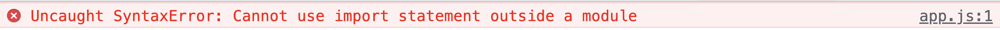

# Vite

비트(Vite)는 기존의 프런트엔드 개발 경험을 향상시켜줄 새로운 프런트엔드 툴입니다. Vue 창시자 에반 유가 만들었으며 현재 Vue, React, Svelte 등의 주요 프레임워크 커뮤니티에서 주목하고 있는 도구입니다. 기존의 프런트엔드 빌드 도구들과 어떠한 차이점이 있는지 어떤 경험을 우리에게 제공해주는지 알아보겠습니다.

## Vite란?

비트는 [자바스크립트 네이티브 모듈](https://developer.mozilla.org/en-US/docs/Web/JavaScript/Guide/Modules)을 기반으로 한 데브 서버입니다. 이미 현대 프런트엔드 개발 생태계는 웹팩을 중심으로 개발 환경과 배포 시스템이 구축되어 있습니다. 그런데 왜 비트와 같은 도구들이 나왔을까요? 그 이유는 웹팩을 사용할 때보다 훨씬 더 빠르게 개발하고 배포할 수 있기 때문입니다. 왜 빠른지 이해하기 위해서는 먼저 번들링과 자바스크립트 네이티브 모듈을 이해해야 합니다.

## 번들링

[웹팩(Webpack)](https://joshua1988.github.io/webpack-guide), [롤업(Rollup)](https://rollupjs.org/guide/en/), [파셀(Parcel)](https://en.parceljs.org/)과 같은 모듈 번들러가 나왔던 이유는 자바스크립트의 모듈화와 깊은 관계가 있습니다. 위에서 자바스크립트 네이티브 모듈이라고 언급했던 ESM(ECMAScript Modules)이 등장하기 전까지는 자바스크립트 언어 레벨에서의 모듈화 방식은 없었습니다. [require.js](https://requirejs.org/) 와 같은 모듈 로더나 [IIFE(Immediately Invoked Function Expression)](https://developer.mozilla.org/en-US/docs/Glossary/IIFE)를 사용하지 않으면 모듈화가 불가능했죠. 이렇게 모듈화를 위한 커뮤니티 레벨의 라이브러리를 사용하다가 마침내 자바스크립트 언어에 모듈화 문법(import, export)이 들어오게 됩니다.

이 모듈화 문법을 이용하여 여러 개의 파일을 하나로 합쳐주거나 의미 있는 단위로 묶어 주는 것을 번들링이라고 하는데 현재 프런트엔드 개발 생태계에서는 모듈 번들러로 대부분 웹팩을 사용하고 있습니다.

## ESM(자바스크립트 네이티브 모듈)

ESM은 모듈화 문법인 `import`, `export`를 별도의 도구 없이 브라우저 자체에서 소화해 낼 수 있는 모듈 방식을 의미합니다. 만약 아래와 같은 코드를 웹팩과 같은 번들러 없이 브라우저에서 실행하면 에러가 발생합니다.

```js
// app.js
import { sum } from './math.js';

console.log(sum(10, 20));
```

```html
<script src="./app.js"></script>
```



기존의 브라우저에서는 `import`와 `export`를 해석할 수 있는 능력이 없었습니다. 하지만, 이제는 `script` 태그에 아래와 같이 `type="module"` 속성을 추가하면 정상 동작하는 것을 볼 수 있습니다.

```html
<script type="module" src="./app.js"></script>
```

브라우저에서 `import`와 `export`를 소화할 수 있는 능력이 바로 ESM입니다.

## Vite 특징

비트는 로컬에서 개발할 때 번들링을 하지 않고 ESM 방식을 사용하기 때문에 로컬 서버 구동 속도가 매우 빠릅니다. 500개 정도 되는 모듈을 갖고 있는 웹 서비스를 [웹팩 데브 서버](https://joshua1988.github.io/webpack-guide/devtools/webpack-dev-server.html)와 비트로 비교해 본다면 실행 시간이 20 ~ 30배 이상 차이가 납니다. 웹팩 데브 서버는 처음 로컬 서버를 시작할 때 관련 있는 모듈들을 번들링 해서 메모리에 적재하는 시간이 필요하기 때문에 당연히 어느 정도의 시간이 필요합니다. 반면 비트는 번들링을 하지 않고 바로 서버를 실행하기 때문에 명령어를 실행함과 동시에 서버가 바로 구동됩니다.

프로덕션을 위한 빌드를 실행할 때도 비트 자체에서 제공해 주는 빌드 옵션이 많습니다. 비트의 빌드 결과물 역시 기본적으로 번들링은 하지 않고 로컬 개발 서버의 ESM 방식을 사용하고 있습니다. 하지만, 서비스 규모가 너무 큰 경우에는 선택적으로 번들링을 하는게 더 이득일 수 있어 번들링 도구로 Rollup을 사용할 수 있습니다. 기본적으로는 비트 자체에서도 충분히 프로덕션으로 배포할 수 있는 수준의 최적화를 진행해 주지만 별도의 번들링과 추가적인 커스텀 빌드 작업을 진행하고 싶은 경우에는 아래와 같이 롤업 번들러를 끼워서 사용할 수 있습니다.

```js
// vite.config.js
module.exports = defineConfig({
  build: {
    rollupOptions: {
      // https://rollupjs.org/guide/en/#big-list-of-options
    }
  }
})
```

## Vite 시작하기

비트 프로젝트를 생성하기 위해서 아래 명령어를 입력합니다.

```sh
npm init vite@latest my-vite
```

리액트, 뷰, 스벨트 등 원하는 템플릿을 선택하여 프로젝트를 생성합니다.

:::tip
비트는 [Node.js 버전 12 이상](https://nodejs.org/en/)에서 정상적으로 동작합니다.
:::