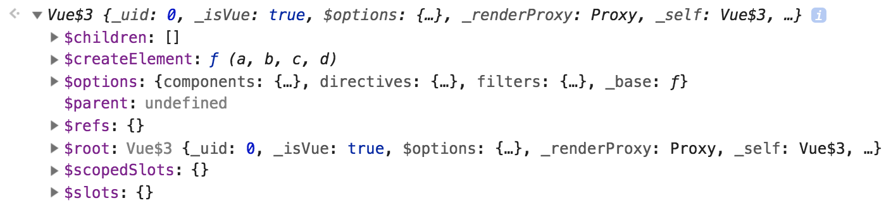

# 뷰 인스턴스

인스턴스는 뷰로 개발할 때 필수로 생성해야 하는 코드입니다. 

## 인스턴스 생성

인스턴스는 아래와 같이 생성할 수 있습니다.

```js
new Vue();
```

인스턴스를 생성하고 나면 아래와 같이 인스턴스 안에 어떤 속성과 API가 있는지 콘솔 창에서 확인할 수 있습니다.

```js
var vm = new Vue();
console.log(vm);
```

크롬 개발자 도구를 열고 Console 패널을 확인하면 아래와 같은 결과가 나옵니다.



이처럼 인스턴스 안에는 미리 정의되어 있는 속성과 메서드(API)들이 있기 때문에 이 기능들을 이용하여 빠르게 화면을 개발해나갈 수 있습니다.

## 인스턴스의 속성, API들

인스턴스에서 사용할 수 있는 속성과 API는 다음과 같습니다.

```js
new Vue({
  el: ,
  template: ,
  data: ,
  methods: ,
  created: ,
  watch: ,
});
```

- el : 인스턴스가 그려지는 화면의 시작점 (특정 HTML 태그)
- [template](/vue/template.html) : 화면에 표시할 요소 (HTML, CSS 등)
- data : 뷰의 반응성(Reactivity)가 반영된 데이터 속성
- [methods](/syntax/methods.html) : 화면의 동작과 이벤트 로직을 제어하는 메서드
- [created](/vue/life-cycle.html) : 뷰의 라이프 사이클과 관련된 속성
- [watch](/syntax/watch.html) : data에서 정의한 속성이 변화했을 때 추가 동작을 수행할 수 있게 정의하는 속성

이외에도 각 속성에 대한 자세한 설명은 관련된 챕터에서 확인할 수 있습니다.
